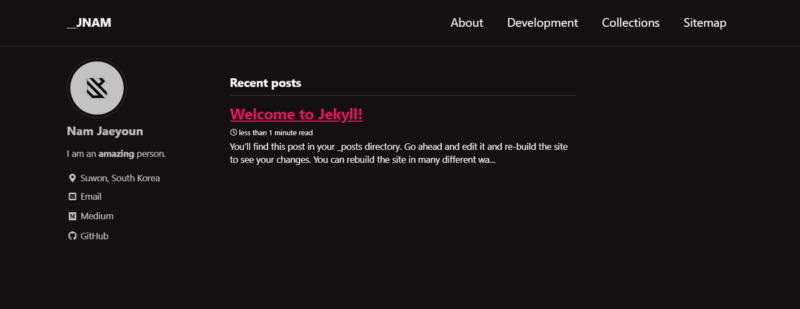
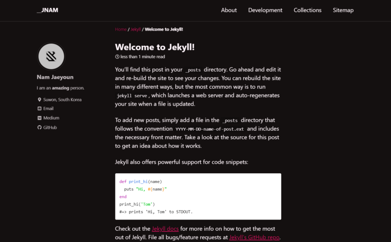

Upload first posts to my web page

[**JY Blog**  
_JY's blog_siisee11.github.io](https://siisee11.github.io/siisee11.github.io_old/ "https://siisee11.github.io/siisee11.github.io_old/")[](https://siisee11.github.io/siisee11.github.io_old/)

(1)에서 만든 페이지에 Navigation을 추가하고 Post를 하나 작성해보도록 한다.



[**Quick-Start Guide**  
_Minimal Mistakes has been developed as a Gem-based theme for easier use, and 100% compatible with GitHub Pages when…_mmistakes.github.io](https://mmistakes.github.io/minimal-mistakes/docs/quick-start-guide/ "https://mmistakes.github.io/minimal-mistakes/docs/quick-start-guide/")[](https://mmistakes.github.io/minimal-mistakes/docs/quick-start-guide/)

위의 document를 참고하여 진행하였다.

-   Navigation

위의 About, Development, Collection과 같은 탭은 \_data/navigation.yml 파일을 수정하여 만들 수 있다.

#으로 주석되어 있는 코드의 주석을 풀어주고 알맞게 수정하면 된다. url은 일단 대충 아무거나 적어도 된다.

```
main:
- title: "About"
  url: https://mmistakes.github.io/minimal-mistakes/about/
- title: "Development"
  url: /year-archive
- title: "Collections"
  url: /collection-archive/
- title: "Sitemap"
  url: /sitemap/
```

-   Post 생성

Post는 최상위 디렉토리에서 \_posts 폴더를 만들고 그 안에 markdown 문법으로 작성된 파일을 만듬으로써 생성된다.

파일 이름은 yyyy-mm-dd-title.md로 만들어야한다. 예를 들면, 2019–12–26-welcome-to-jekyll.md로 만들어야한다.

파일 내용은 아래와 같이 작성한다.

markdown으로 작성한거라 자동으로 코드를 랜더링해서 보여주기 때문에 위와 같이 보이는데, raw 코드를 복사 붙혀넣기 해주면 된다. 기본적으로 마크다운 쓰는 형식 그대로 블로그 포스트가 생선되고, 위의 표 부분 (Jekyll에서는 이를 front matter라고 부름)이 해당 포스트의 해더처럼 쓰인다고 보면된다.


