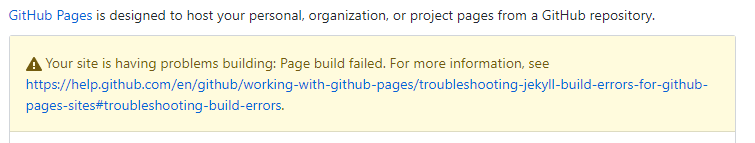
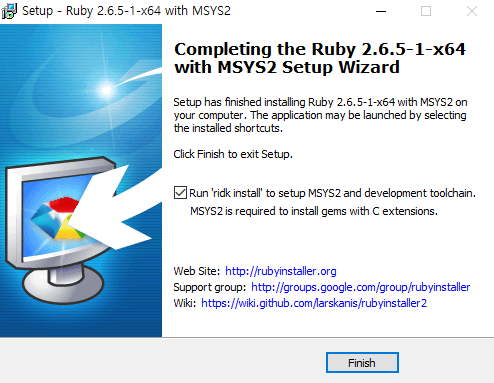
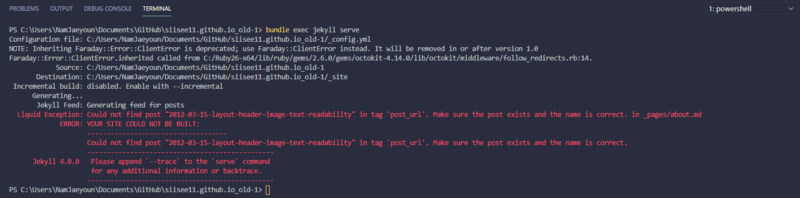
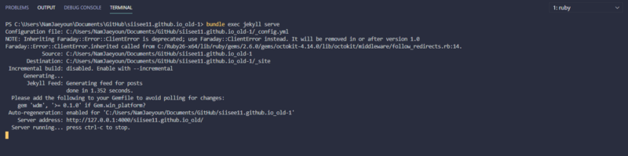

Testing your GitHub Pages site locally with Jekyll

매번 사이트를 바꿀 때마다 github에 push해서 테스트해볼 수는 없다. 그리고 github에 push하는 방법으로는 에러메세지를 볼 수 없어서 에러가 나면 처리하기 힘들다.



따라서, localhost로 사이트를 띄워볼 수 있게 세팅하는 것이 좋다.

그러기 위해서는 일단 Jakyll를 설치해야한다.

-   Window의 경우 Ruby installer를 통해서 설치할 수 있다

[**RubyInstaller for Windows**  
_RubyInstaller versions 2.6.5-1, 2.5.7-1 and 2.4.9-1 are released. These are maintenance releases with bug and security…_rubyinstaller.org](https://rubyinstaller.org/ "https://rubyinstaller.org/")[](https://rubyinstaller.org/)

마지막에 ridk install를 체크해주어야 한다. 그 후 1 엔터.



설치가 완료되었으면 관리자 권한으로 powershell을 열어서 jekyll과 bundler를 깔아준다. 설치 확인은 jekyll -v 로 버전 확인해보면 된다.

```
$ gem install jekyll bundler

# after installation
$ jekyll -v
jekyll 4.0.0
```

이제 VScode로 돌아가서 터미널을 열고

```
$ bundle exec jekyll serve
```

혹시 뭐가 없다고 에러가 난다면

```
$ bundle install
```

이제 에러메세지도 잘 뜨는 것을 볼 수 있다.



에러를 해결하게 되면 아래와 같이 나타나고 Server address로 접속하면 웹페이지를 확인할 수 있다.



---

incompatible character encodings: UTF-8 and CP949 오류가 발생한다면

```
chcp 65001
```

를 입력해서 해결할 수 있다. (chcp는 커맨드창의 언어셋을 바꿔주는 명령어이다.)
