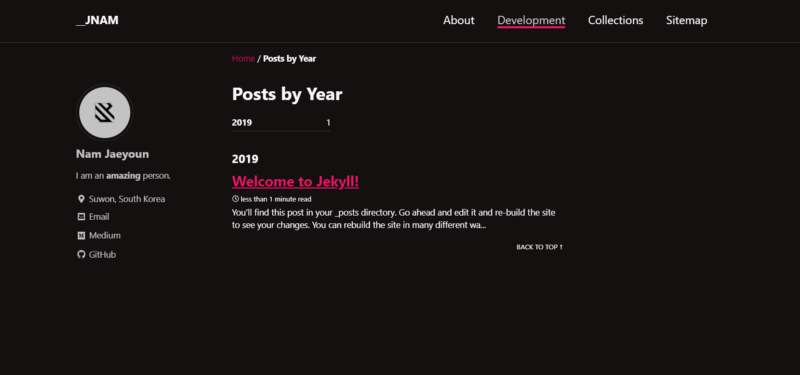

Create pages and posts and see how it works



기존의 만들어 놓은 navigation을 클릭해서 새로운 페이지로 넘가는 방법을 알아보고, minimal-mistakes에서 제공하는 페이지와 포스트 및 레이아웃등을 참고하는 방법을 알아보자.

-   \_data/navigation.yml 수정

기존의 \_data/navigation.yml을 수정해서 About, Development를 눌렀을 때 내가 원하는 페이지를 보여주도록 한다.

기존의 navigation.yml에서는   
About의 url: [https://mmistakes.github.io/minimal-mistakes/about/](https://mmistakes.github.io/minimal-mistakes/about/)   
이 었기 때문에 mmistakes.github.io로 이동하게 되었지만, 이를 /about/으로 바꾸어 내 페이지의 /about/으로 이동하게 한다.

```
main:
- title: "About"
url: /about/
- title: "Development"
url: /year-archive/

<이하 생략>
```

-   \_pages 생성

/about/ 과 /year-archive/에 해당하는 페이지를 만들어주어야한다. 그렇지 않으면 해당 url이 존재하지 않으므로 404페이지가 띄워진다.

먼저, 최상위 디렉토리 밑에 \_pages/ 디렉토리를 생성한다.

그 후에 페이지를 만들어야되는데 어떻게 만들지 막막하므로 mmistake의 코드를 참고하면된다.

[**mmistakes/minimal-mistakes**  
_Minimal Mistakes is a flexible two-column Jekyll theme, perfect for building personal sites, blogs, and portfolios. As…_github.com](https://github.com/mmistakes/minimal-mistakes "https://github.com/mmistakes/minimal-mistakes")[](https://github.com/mmistakes/minimal-mistakes)

위 github에서 docs/ 밑에 예시코드들이 구현되어 있다. 이를 참고해서 하나하나 만들어나가면 된다.

이 중에 지금 필요한 docs/\_pages/about.md 와 year\_achive.md를 복사해서 위에서 생성한 \_pages 폴더에 넣어준다.

위의 url : /year-archive/부분은 year\_achive.md에서 permalink에 해당하는 부분이다. permalink를 찾아서 그 페이지를 띄워주는 것이다.

```
<year_achive.md>
---
title: "Posts by Year"
permalink: /year-archive/
layout: posts
author_profile: true
---
```

---

about.md 에서 post가 없다고 에러가 날 것 인데, 해당 라인을 삭제하거나 포스트를 docs/\_post/ 에서 찾아서 복사해오면 된다.
