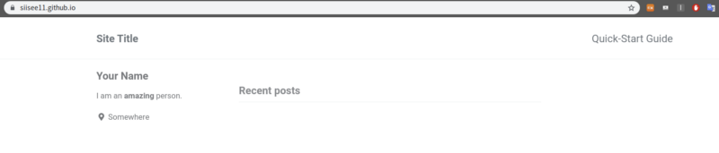
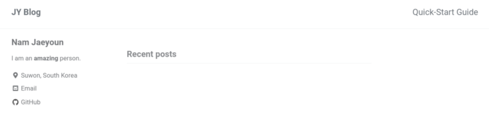

jekyll로 github.io 블로그 페이지 만들기

[**JY Blog**  
_JY's blog_siisee11.github.io](https://siisee11.github.io/siisee11.github.io_old/ "https://siisee11.github.io/siisee11.github.io_old/")[](https://siisee11.github.io/siisee11.github.io_old/)

blog 혹은 portfolio를 github에서 제공하는 방법으로 만드는 방법이다. 위의 깃허브 링크 참고하세요.

github 내부에서 Jekyll를 지원해주기 때문에, jekyll 테마를 fork해와서 사용하는 방법으로 아주 쉽게 만들 수 있다.

[**mmistakes/minimal-mistakes**  
_Minimal Mistakes is a flexible two-column Jekyll theme, perfect for building personal sites, blogs, and portfolios. As…_github.com](https://github.com/mmistakes/minimal-mistakes "https://github.com/mmistakes/minimal-mistakes")[](https://github.com/mmistakes/minimal-mistakes)

위의 테마를 사용하였고, 아래의 quick-start 를 참고하였다.

[**Quick-Start Guide**  
_Minimal Mistakes has been developed as a Gem-based theme for easier use, and 100% compatible with GitHub Pages when…_mmistakes.github.io](https://mmistakes.github.io/minimal-mistakes/docs/quick-start-guide/ "https://mmistakes.github.io/minimal-mistakes/docs/quick-start-guide/")[](https://mmistakes.github.io/minimal-mistakes/docs/quick-start-guide/)

위의 Minimal Mistakes 테마로 연습하고 다른 테마를 적용해서 웹페이지를 꾸밀 계획이다. 아래에서 무료 테마들을 찾아볼 수 있다.

[**20+ Jekyll Themes and Templates | Wow Themes**  
_Jekyll is a static website generator without a database; it turns your simple text into static websites (blogs…_www.wowthemes.net](https://www.wowthemes.net/jekyll-themes-templates/ "https://www.wowthemes.net/jekyll-themes-templates/")[](https://www.wowthemes.net/jekyll-themes-templates/)

사실 웹페이지 띄우는 거는 별거 없는게, 그냥 위의 repository를 fork해와서 repository의 이름을 Username.github.io로 바꿔주면 된다.


그 후에 Username.github.io를 접속해보면 기본적인 틀아 잡힌 것을 볼 수 있다.



다시 Repository로 돌아가서 아래에 해당되는 파일들은 필요없으니 삭제해도 된다. (/docs 은 참고하기 좋으니 삭제하지 않아도 좋다.)

-   `.editorconfig`
-   `.gitattributes`
-   `.github`
-   `/docs`
-   `/test`
-   `CHANGELOG.md`
-   `minimal-mistakes-jekyll.gemspec`
-   `README.md`
-   `screenshot-layouts.png`
-   `screenshot.png`

내 정보들로 업데이트 하기 위해서 \_config.yml 파일을 수정해주면 된다.

```
remote_theme           : "mmistakes/minimal-mistakes"
minimal_mistakes_skin    : "default" # "air", "aqua", "contrast", "dark", "dirt", "neon", "mint", "plum", "sunrise" # 
Site Settingslocale                   : "en-US"
title                    : "JY Blog"
title_separator          : "-"
subtitle                 : # site tagline that appears below site title in masthead
name                     : "Nam Jaeyoun"
description              : "An amazing website."
url                      : "https://siisee11.github.io"
baseurl                  : # the subpath of your site, e.g. "/blog"
repository               : # GitHub username/repo-name e.g. "mmistakes/minimal-mistakes"
```

위와 같은 식으로 예시를 잘보고 맞게 고치면 된다.


