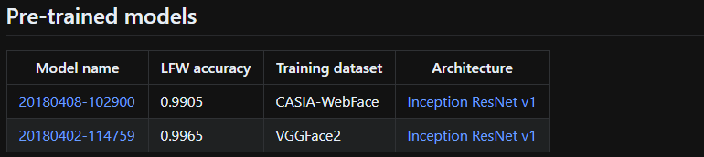

facenet wiki의 예시를 따라해보았습니다.

얼굴 인식 및 분류를 하기 위해서 facenet을 이용해보려고 합니다. 먼저 wiki에 있는 예시를 실행해보면서 코드를 이해하고 적용해볼 생각입니다.

[**davidsandberg/facenet**  
_Face recognition using Tensorflow. Contribute to davidsandberg/facenet development by creating an account on GitHub._github.com](https://github.com/davidsandberg/facenet/wiki/Validate-on-LFW "https://github.com/davidsandberg/facenet/wiki/Validate-on-LFW")[](https://github.com/davidsandberg/facenet/wiki/Validate-on-LFW)

-   Prerequisite

먼저 python 환경이 필요합니다. Anaconda를 설치하셔도 좋습니다.

GPU가 있는 머신이 필요합니다.

-   Clone

facenet 레파지토리를 클론하고 requirements들을 다운로드 받습니다.

```
https://github.com/davidsandberg/facenet.git
pip install -r requirements.txt
```

-   PYTHONPATH

파이썬 패스를 설정해주어야 합니다. 아래에서 \[…\] 은 facenet 디렉토리가 있는 경로를 적어주시면 됩니다. (ex. /home/siisee11/facenet/src)

```
export PYTHONPATH=[...]/facenet/src
```

-   Download dataset

[http://vis-www.cs.umass.edu/lfw/lfw.tgz](http://vis-www.cs.umass.edu/lfw/lfw.tgz) 에서 데이터를 다운로드 받습니다. 예시에서는 ~/Downloads 에 lfw.tgz 파일을 다운로드 받았습니다.

```
~/Downloads$ wget http://vis-www.cs.umass.edu/lfw/lfw.tgz
```

~/datasets/lfw/raw 에 압축을 풀어줍니다.

```
cd ~/datasets
mkdir -p lfw/raw
tar xvf ~/Downloads/lfw.tgz -C lfw/raw --strip-components=1
```

-   Align lfw dataset

다음으로 mtcnn을 이용해서 face detection 및 alignment(이미지 프리프로세싱)를 진행합니다. 다음 스텝에서 160\*160 이미지를 사용하기 때문에 이에 맞춰서 이미지를 맞춰서 ~/datasets/lfw/lfw\_mtcnnpy\_160 에 저장합니다.

```
for N in {1..4}; do \
python src/align/align_dataset_mtcnn.py \
~/datasets/lfw/raw \
~/datasets/lfw/lfw_mtcnnpy_160 \
--image_size 160 \
--margin 32 \
--random_order \
--gpu_memory_fraction 0.25 \
& done
```

이 때, GPU out of memory가 발생한다면 fraction 값을 0.2정도로 낮춰주면 됩니다.

또 다른 에러로,

`allow_pickle=false`

라는 에러가 뜰 때가 있는데, 이는 numpy 버전 때문인데, src/align/detect\_face.py 에서 np.load를 찾아서

```
np.load(..., ..., allow_pickle=True)
```

마지막에 allow\_pickle=True 를 적어주면 된다.

-   Download models

추출한 얼굴 이미지들을 사용해서 학습을 해야하지만, 여기서는 미리 학습된 모델을 사용하여 validation만 진행하도록 합니다. 모델은 wiki 페이지나 facenet 깃헙 메인페이지에서 다운로드 받을 수 있습니다.

[**davidsandberg/facenet**  
_This is a TensorFlow implementation of the face recognizer described in the paper "FaceNet: A Unified Embedding for…_github.com](https://github.com/davidsandberg/facenet "https://github.com/davidsandberg/facenet")[](https://github.com/davidsandberg/facenet)



-   Run test

Align lfw dataset을 해두었기 때문에, 해당 스텝에서 추출된 얼굴 이미지들을 test set으로 이용해서 다운로드 받은 모델의 성능을 측정해볼수 있다.

```
python src/validate_on_lfw.py \
~/datasets/lfw/lfw_mtcnnpy_160 \
~/models/facenet/20180402-114759 \
--distance_metric 1 \
--use_flipped_images \
--subtract_mean \
--use_fixed_image_standardization
```

> 만약, KeyError: “The name ‘decode\_image/cond\_jpeg/is\_png’ refers to an Operation not in the graph.” 에러가 발생한다면, 이는 tensorflow의 버전에 따라 발생하는 문제인데, tensorflow 버전을 1.7이나 1.12로 바꾸거나 코드를 살짝 수정해야한다.

src/facenet.py 에서 create\_input\_pipeline 함수를 찾아서

```
103 def create_input_pipeline(input_queue, image_size, nrof_preprocess_threads, batch_size_placeholder):
104     with tf.name_scope("tempscope"):
105         images_and_labels_list = []
106         for _ in range(nrof_preprocess_threads):
107             filenames, label, control = input_queue.dequeue()
108             images = []
109             for filename in tf.unstack(filenames):
```

with tf.name\_scope(“tempscope”)를 추가하여 이렇게 수정해준다.

다음과 같은 결과를 확인할 수 있다.

```
Runnning forward pass on LFW images
........................
Accuracy: 0.99133+-0.00433
Validation rate: 0.96367+-0.01636 @ FAR=0.00067
Area Under Curve (AUC): 0.999
Equal Error Rate (EER): 0.009
```
