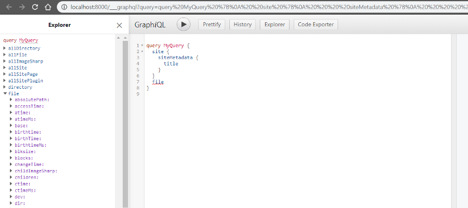
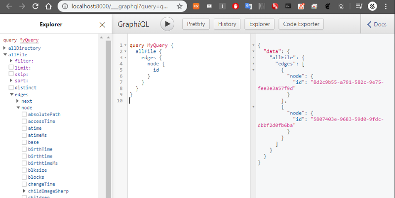
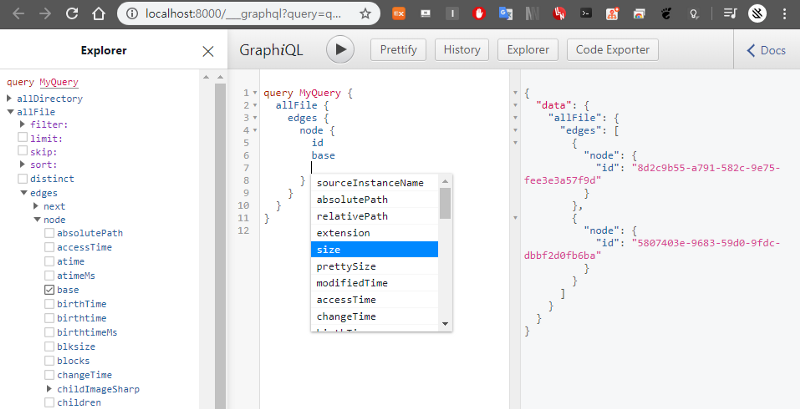
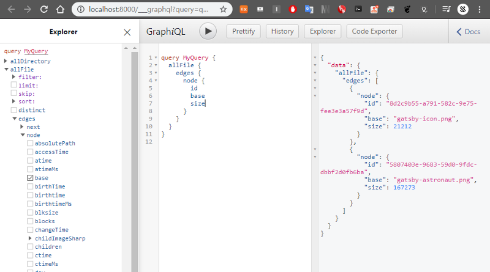
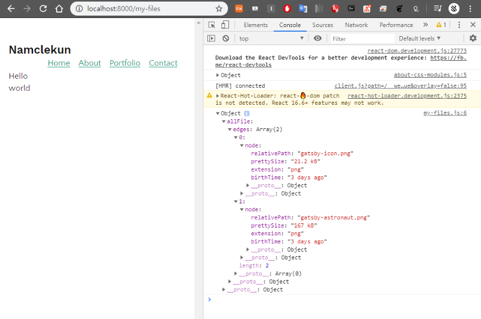

GraphiQL 활용


[**Gatsby.js로 블로그 만들기\[6\]**  
_data in gatsby_medium.com](https://medium.com/@siisee111/gatsby-js%EB%A1%9C-%EB%B8%94%EB%A1%9C%EA%B7%B8-%EB%A7%8C%EB%93%A4%EA%B8%B0-6-11334abf5880 "https://medium.com/@siisee111/gatsby-js%EB%A1%9C-%EB%B8%94%EB%A1%9C%EA%B7%B8-%EB%A7%8C%EB%93%A4%EA%B8%B0-6-11334abf5880")[](https://medium.com/@siisee111/gatsby-js%EB%A1%9C-%EB%B8%94%EB%A1%9C%EA%B7%B8-%EB%A7%8C%EB%93%A4%EA%B8%B0-6-11334abf5880)

GraphQL을 이용해서 데이터를 컴포넌트에 넣어주는 것을 \[6\]에서 해보았다.

데이터를 얻기위해서 쿼리를 작성해야 되는데, 이를 도와주는 툴을 Gatsby에서 제공한다. 그것이 바로 GraphiQL Explorer이다.

```
> gatsby develop
```

위 커맨드를 입력한 후 [http://localhost:8000/\_\_\_graphql](http://localhost:8000/___graphql) 에 접속하는 것으로 사용할 수 있다.

### Source plugins

본격적으로 GraphiQL을 사용하기 전에 플러그인 하나를 받아야한다. 이는 source에서 데이터를 가져올 수 있게 해준다. 예를 들어 filesystem source plugin은 파일 시스템에서 데이터를 가져올 수 있게 해준다.

```
npm install --save gatsby-source-filesystem
```

위 커맨드로 설치하자. 그 후에 gatsby-config.js 파일에 다음을 추가한다. (아래에서 path: 가 `${__dirname}/src/`로 잡혀있는데 아래의 캡쳐 사진들은 path:가 `${__dirname}/src/image/`로 되어 있어서 결과가 다르게 나타난다.)

```
{
    resolve: `gatsby-source-filesystem`,
    options: {
        name: `src`,
        path: `${__dirname}/src/`,
    },
},
```

저장한 후에 다시 gatsby develop을 통해 서버를 실행시킨다. 그 후에 GraphiQL을 다시 열면 왼쪽 explorer에 없던 allFile과 file이 생긴 것을 볼 수 있다.



allFile을 클릭하면 자동으로 모든 파일에 대하여 id를 얻어내는 쿼리를 작성해준다. ctrl + Enter 혹은 위의 실행 버튼으로 쿼리문을 실행시켜서 결과를 확인 할 수 있다.



모든 파일의 id 말고도 다른 정보를 얻고 싶다면 옆의 특성들을 체크해주거나 직접 콘솔에 작성해주면 된다. ctrl + space로 자동완성을 할 수 있다.



그 후에 ctrl + enter로 데이터를 얻어보자.



옆의 얻어진 정보(object)들은 “node”라고 불린다.

### GraghQL query로 페이지 만들기

GraphiQL을 활용해서 쿼리를 작성하고 이를 통해 얻어온 데이터로 페이지를 만들어보자.

src/pages 밑에 my-files.js 파일을 만들어서 아래 내용을 작성한다.

```
import React from "react"
import { graphql } from "gatsby"
import Layout from "../components/layout"

export default ({ data }) => {
  console.log(data)
  return (
    <Layout>
      <div>Hello world</div>
    </Layout>
  )
}

export const query = graphql`
  query {
    allFile {
      edges {
        node {
          relativePath
          prettySize
          extension
          birthTime(fromNow: true)
        }
      }
    }
  }
`
```

위의 코드를 보면 `console.log(data)` 가 있는데, 이는 console창에 로그를 찍는 함수이다. 콘솔창은 크롬브라우져에서 F12키를 눌러서나오는 개발자 툴에서 Console 탭을 눌러 확인할 수 있다.

Query문으로 받아온 데이터가 찍혀있는 것을 확인할 수 있다.



data를 잘 얻어오는 것을 확인했으니 이제 데이터를 사용해서 Component를 구성해본다. 아래와 같이 코드를 작성한다.

my-files.js

[http://localhost:8000/my-files](http://localhost:8000/my-files) 에서 만들어진 페이지를 확인해보자.


---

위 캡쳐들에서 두개의 결과 밖에 뜨지 않는 이유는 gatsby-config.js에서 path를 `${__dirname}/src/image/` 로 설정했기 때문에 src/image/의 자료들만 보여지는 것이다.
