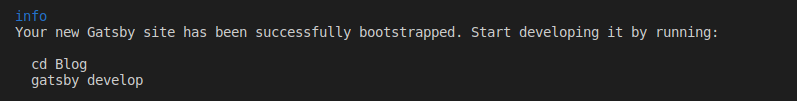
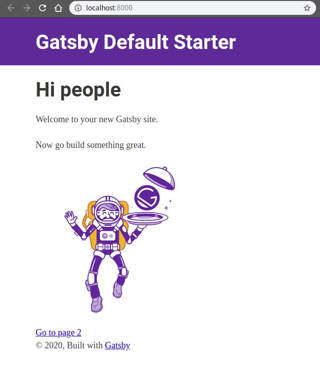

Jekyll은 너무 지루해

Jekyll로 github.io 웹 페이지를 만들어서 관리하려고 했으나,

> 다른 사람들이 만들어 놓은 테마에서 조금 조금 바꿔서 포스트만 올리는 것은 재미가 없고,  
> Ruby나 Jekyll 둘 다 잘 알지 못하고,  
> Gatsby.js 와 typescript를 새로 배워보고 싶은 참이라

Gatsby.js로 웹페이지를 만들어 보기로 결정했다.


Gatsby.js는 뭘까?…..는 나중에

일단 한번 실행해보는게 재밌으니, Gatsby.js 공식 홈페이지의 Step-by-Step 튜토리얼을 참조해서 진행해 보도록 한다. (링크는 아래)

[**Gatsby.js Tutorials**  
_Welcome to Gatsby! We're glad you're here. The goal of this tutorial is to guide you through setting up and deploying…_www.gatsbyjs.org](https://www.gatsbyjs.org/tutorial/ "https://www.gatsbyjs.org/tutorial/")[](https://www.gatsbyjs.org/tutorial/)

---

-   Nodejs 설치
-   Git 설치
-   VScode 설치

다른 에디터 써도 된다.

만약 VScode를 사용한다면 extension 에서 prettier를 찾아 설치해주자.

-   Gatsby Cli 설치

Gatsby Cli는 npm을 통해서 설치가능하다.

```
npm install -g gatsby-cli
```

-   Gatsby site 만들기

여기서 나와 같이 Gatsby로 github.io 사이트를 만들고 싶은 거라면 아래와 같이 따라하면 된다.

```
1. github에 username.github.io 레파지토리 생성

2. VScode에서 git clone https://username.github.io.git

3. Terminal을 열어서 
> gatsby new Blog
```

웹 브라우저에서 확인해보자.

```
1. develop
> cd Blog
> gatsby develop

2.http://localhost:8000/ 접속
```

이제 현재까지 한 것을 github에 push해주자.

```
> git add --all
> git commit -m "Upload gatsby"
> git push
```

---

Gatsby로 간단한 웹페이지를 띄워 보았다.

위에서 gatsby new 커맨드로 템플릿을 만들 때, 좀 더 완성도 있는 템플릿 (스타터라고 부른다.)을 다운로드 받아서 실행해 볼 수 있다.

```
gatsby new [SITE_DIRECTORY] [URL_OF_STARTER_GIT_REPO]
```

SITE\_DIRECTORY는 Blog 같은 폴더명이 되고

URL\_OF\_STARTER\_GET\_REPO는 아래에서 찾아서 붙혀넣어주면 된다.

[**Library**  
_Gatsby Starters: Library_www.gatsbyjs.org](https://www.gatsbyjs.org/starters/?v=2 "https://www.gatsbyjs.org/starters/?v=2")[](https://www.gatsbyjs.org/starters/?v=2)

---

username.github.io에 페이지를 띄우는 것은 \[3\]에 설명되어 있다.

[**Gatsby.js로 블로그 만들기\[3\]**  
_gh-pages로 github.io에 올리기_medium.com](https://medium.com/@siisee111/gatsby-js%EB%A1%9C-%EB%B8%94%EB%A1%9C%EA%B7%B8-%EB%A7%8C%EB%93%A4%EA%B8%B0-3-756bdcfc2874 "https://medium.com/@siisee111/gatsby-js%EB%A1%9C-%EB%B8%94%EB%A1%9C%EA%B7%B8-%EB%A7%8C%EB%93%A4%EA%B8%B0-3-756bdcfc2874")[](https://medium.com/@siisee111/gatsby-js%EB%A1%9C-%EB%B8%94%EB%A1%9C%EA%B7%B8-%EB%A7%8C%EB%93%A4%EA%B8%B0-3-756bdcfc2874)

---

#### 다음포스트

[**Gatsby.js로 웹페이지 만들기\[2\]**  
_Step-by-Step!_medium.com](https://medium.com/@siisee111/gatsby-js%EB%A1%9C-%EC%9B%B9%ED%8E%98%EC%9D%B4%EC%A7%80-%EB%A7%8C%EB%93%A4%EA%B8%B0-2-8c6e214feeb6 "https://medium.com/@siisee111/gatsby-js%EB%A1%9C-%EC%9B%B9%ED%8E%98%EC%9D%B4%EC%A7%80-%EB%A7%8C%EB%93%A4%EA%B8%B0-2-8c6e214feeb6")[](https://medium.com/@siisee111/gatsby-js%EB%A1%9C-%EC%9B%B9%ED%8E%98%EC%9D%B4%EC%A7%80-%EB%A7%8C%EB%93%A4%EA%B8%B0-2-8c6e214feeb6)
