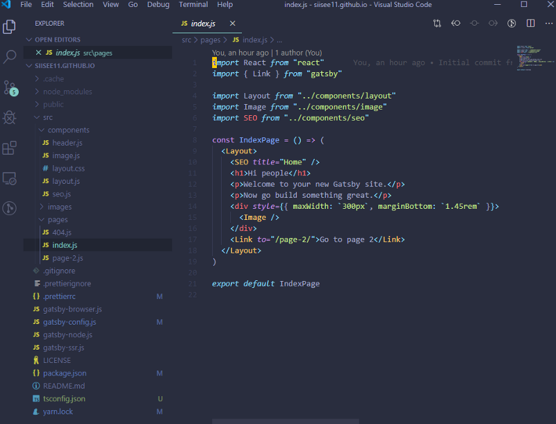
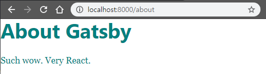
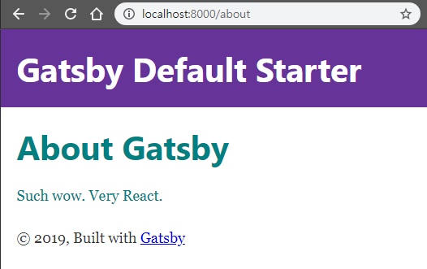
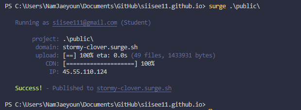

Step-by-Step!

[**Gatsby.js로 웹페이지 만들기\[1\]**  
_Jekyll은 너무 지루해_medium.com](https://medium.com/@siisee111/gatsby-js%EB%A1%9C-%EC%9B%B9%ED%8E%98%EC%9D%B4%EC%A7%80-%EB%A7%8C%EB%93%A4%EA%B8%B0-1-11d5cf3336c6 "https://medium.com/@siisee111/gatsby-js%EB%A1%9C-%EC%9B%B9%ED%8E%98%EC%9D%B4%EC%A7%80-%EB%A7%8C%EB%93%A4%EA%B8%B0-1-11d5cf3336c6")[](https://medium.com/@siisee111/gatsby-js%EB%A1%9C-%EC%9B%B9%ED%8E%98%EC%9D%B4%EC%A7%80-%EB%A7%8C%EB%93%A4%EA%B8%B0-1-11d5cf3336c6)

이전 포스트에서 설정하고 페이지를 띄워보는 것 까지 하였다.

-   Gatsby pages와 친해지기

/src 폴더 밑에 pages/ 폴더를 열면 index.js 파일이 있다.

내용을 보면 IndexPage 라는 컴포넌트를 하나 만든다.



> _옆에_ [_http://localhost:8000/_](http://localhost:8000/) _을 띄워두고 Hi people을 Hi Gatsby로 바꿔보면, 바로 웹페이지의 내용이 바뀌는 것을 볼 수 있다. 이를_ **_Hot reloading_**_이라고 하고 이 기능은 개발 속도를 올려준다._

Hi Gatsby가 더 잘 보이도록 <h1>에 스타일을 추가해주자.

```
<h1 style={{ color: 'purple', fontSize: '72px'}}>Hi Gatsby</h1>
```

스타일 속성을 추가해서 여러가지 변화를 줄 수 있다.

아래 글씨들 까지 보라색으로 바꾸기위해 새로운 <div> 구역을 추가해서 같은 스타일을 준다.

```
<div style={{ color: 'purple'}}>
    <h1 style={{ fontSize: '72px'}}>Hi Gatsby</h1>
    <p>Welcome to your new Gatsby site.</p>
    <p>Now go build something great.</p>
</div
```

-   JSX and React

위의 코드들을 보면 HTML 코드 같은데, js 코드에서 쓰고 있는 것이 이상하다. 사실 위의 코드는 React에서 쓰이는 JSX라는 것이지, HTML이 아니다. React를 import하는 이유가 JSX를 사용하기 위함이었다. (더 자세한 내용은 React.js를 공부해봐야 알 수 있다.)

-   Component

위에서 컴포넌트라는 단어를 사용했었다. 이 단어는 리액트에서도 사용되는 단어인데, 하나의 UI를 갖는 구성 단위이다. 예를 들면, 웹사이트에서 위에 있는 Header나 옆에 따라다니는 Sidebar 같은 사이트를 구성하는 요소들이다.

이 컴포넌트를 사용하면서 CSS, HTML, Javascript가 대부분 한파일에 어울어지게 되었다. 예를 들어 위에서 CSS파일을 적용하는 대신 style 속성을 부여한 것을 확인하면 된다.

-   Pages

index.js와 같이 pages/ 의 .js 파일들은 자동적으로 페이지가 된다.

index.js는 만들어 보았으니, about.js 파일을 만들어서 확인해보자. 파일을 만들고 아래의 내용을 입력한다.

```
import React from "react"

export default () => (
  <div style={{ color: `teal` }}>
    <h1>About Gatsby</h1>
    <p>Such wow. Very React.</p>
  </div>
)
```

저장하고 [http://localhost:8000/about/](http://localhost:8000/about/) 에 접속한다.



---

-   Sub-component

홈페이지를 만들면 코드가 점점 길어지고 썼던 코드 다시쓰는 일들이 발생한다. 이를 위해서 UI를 sub-component로 쪼개서 재사용할 수 있는 기능이 있다.

index.js

위 코드에서 import Layout from “../components/layout”으로 불러온 Layout을 <Layout>…</Layout>으로 사용한 것을 볼 수 있다. 이 Layout이 컴포넌트의 예시이다. <Layout>…</Layout>을 <div>…</div>로 바꿔보면 이 Layout이 무슨 역할을 하는지 알 수 있다.

컴포넌트는 재사용이 가능하다고 하니, 이 Layout을 about.js에 재사용하여보자. 코드를 아래와 같이 바꾸고 [http://localhost:8000/about/](http://localhost:8000/about/) 에 접속한다.

What component do

---

-   Link (페이지 이동)

Link 즉 페이지 이동은 간단하다. index.js를 보면 이미 Link가 쓰이고 있다.

```
<Link to="/page-2/">Go to page 2</Link>
```

Go to page 2를 누르면 /page-2/에 해당하는 페이지로 이동하게 되고, 이 페이지는 pages/page-2.js를 통해 만들어 졌다.

---

-   Gatsby 사이트 deploy하기

[Surge](https://surge.sh/)를 이용해서 사이트를 deploy할 것이다. 먼저, Surge를 설치하고 회원가입 및 로그인을 진행한다.

```
>npm install --global surge
>surge login
```

레파지토리의 가장 최상위 폴더로 이동해서 빌드를 진행한다

```
>gatsby build
```

public/에 뭐가 생겼나 확인한 후 publishing 진행.

```
>ls public
>surge public/
```

각자 부여받은 도메인에 접속해보면 내가 만든 페이지가 뜨는 것을 확인 할 수 있다. (내 경우에는 [http://stormy-clover.surge.sh/](http://stormy-clover.surge.sh/))

---

#### 다음포스트

[**Gatsby.js로 블로그 만들기\[3\]**  
_gh-pages로 github.io에 올리기_medium.com](https://medium.com/@siisee111/gatsby-js%EB%A1%9C-%EB%B8%94%EB%A1%9C%EA%B7%B8-%EB%A7%8C%EB%93%A4%EA%B8%B0-3-756bdcfc2874 "https://medium.com/@siisee111/gatsby-js%EB%A1%9C-%EB%B8%94%EB%A1%9C%EA%B7%B8-%EB%A7%8C%EB%93%A4%EA%B8%B0-3-756bdcfc2874")[](https://medium.com/@siisee111/gatsby-js%EB%A1%9C-%EB%B8%94%EB%A1%9C%EA%B7%B8-%EB%A7%8C%EB%93%A4%EA%B8%B0-3-756bdcfc2874)
