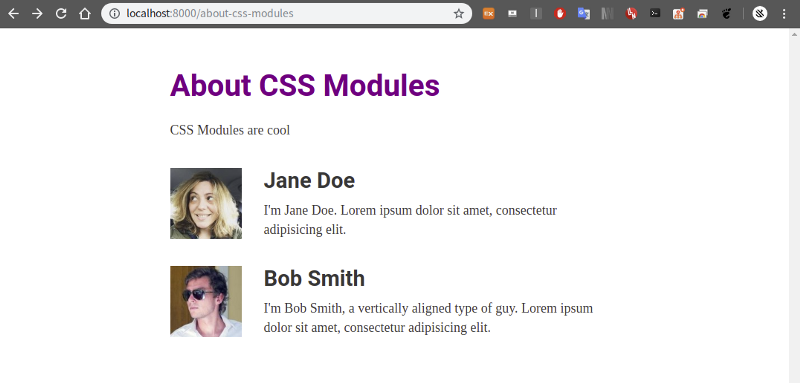

스타일링


이전 포스트들에서 이어집니다.

[**Gatsby.js로 블로그 만들기\[3\]**  
_gh-pages로 github.io에 올리기_medium.com](https://medium.com/@siisee111/gatsby-js%EB%A1%9C-%EB%B8%94%EB%A1%9C%EA%B7%B8-%EB%A7%8C%EB%93%A4%EA%B8%B0-3-756bdcfc2874 "https://medium.com/@siisee111/gatsby-js%EB%A1%9C-%EB%B8%94%EB%A1%9C%EA%B7%B8-%EB%A7%8C%EB%93%A4%EA%B8%B0-3-756bdcfc2874")[](https://medium.com/@siisee111/gatsby-js%EB%A1%9C-%EB%B8%94%EB%A1%9C%EA%B7%B8-%EB%A7%8C%EB%93%A4%EA%B8%B0-3-756bdcfc2874)

이번 포스트는 Styling에 대한 내용이다. 역시 공식 문서를 참고해서 만들었다.

Styling은 필요에 의해서 찾아보고 배우고 쓰게 되어있기 때문에 간략하게 기초적인 것들만 나열하겠다.

Styling은 총 3가지로 분류된다.

### Global Style

전통적인 css 파일을 만들어서 스타일을 준다.

/src 밑에 styles 폴더를 만들고 그 안에 global.css 파일을 만들어준다.

```
├── package.json
├── src
│   └── pages
│       └── index.js
│   └── styles
│       └── global.css
```

파일 안에 다음의 내용을 적어준다. 문서의 배경색을 바꿔준다는 내용이다.

```
html {
  background-color: lavenderblush;
}
```

최 상위 디렉토리에 gatsby-brower.js 파일을 만들어준다. (이미 있을 것이다.)

```
├── package.json
├── src
│   └── pages
│       └── index.js
│   └── styles
│       └── global.css
├── gatsby-browser.js
```

gatsby-brower.js 는 Gatsby가 사용하는 특별한 파일 이다 정도로만 알아두자.

아래의 내용을 추가한다.

```
import "./src/styles/global.css"
```

새로 고침을 해보면 배경화면 색이 바뀐 것을 볼 수 있다.

### **Component-Scoped CSS**

컴포넌트 맞춤 CSS (module CSS) 를 만들어서 적용한다. module CSS는 네이밍 같은 것이 지역적으로 적용된다고 한다.

src/component 에 container.js 파일을 만들어 다음 내용을 추가한다.

```
import React from "react"
import containerStyles from "./container.module.css"

export default ({ children }) => (
  <div className={containerStyles.container}>{children}</div>
)
```

같은 디렉토리에 (src/component) container.module.css 파일을 만들어 다음 내용을 추가한다.

```
.container {
    margin: 3rem auto;
    max-width: 600px;
}
```

module CSS를 적용한 컴포넌트를 테스트할 page를 하나 생성한다. src/pages 밑에 about-css-module.js 파일을 만들어 다음 내용을 추가한다.

```
import React from "react"

import Container from "../components/container"

export default () => (
  <Container>
    <h1>About CSS Modules</h1>
    <p>CSS Modules are cool</p>
  </Container>
)
```

이제 우리가 만든 페이지([http://localhost:8000/about-css-modules/](http://localhost:8000/about-css-modules/))에 접속해 보자.

---

Module CSS를 이용해서 좀 더 꾸며보자. CSS활용하는 방법은 해보면서 익히는 것이다.

src/pages 밑에 about-css-modules.module.css 파일을 추가해서 다음의 내용을 추가한다.

```
.user {
  display: flex;
  align-items: center;
  margin: 0 auto 12px auto;
}

.user:last-child {
  margin-bottom: 0;
}

.avatar {
  flex: 0 0 96px;
  width: 96px;
  height: 96px;
  margin: 0;
}

.description {
  flex: 1;
  margin-left: 18px;
  padding: 12px;
}

.username {
  margin: 0 0 12px 0;
  padding: 0;
}

.excerpt {
  margin: 0;
}
```

about-css-modules.js 에 User 컴포넌트를 만들어서 about-css-modules.module.css로 스타일을 줘보자.

### CSS-in-JS

마지막은 CSS-in-JS이다. css파일을 따로 만들지 않고 스타일을 추가하는 방법이다.

about-css-modules.js 에서 <h1> 태그에 style 속성을 추가한다.

```
<h1 style={{color : 'purple'}}>About CSS Modules</h1>
```

색상이 보라색으로 변한 것을 볼 수 있다.

---

#### 다음포스트

[**Gatsby.js로 블로그 만들기\[5\]**  
_layout 구성 및 plugin 사용_medium.com](https://medium.com/@siisee111/gatsby-js%EB%A1%9C-%EB%B8%94%EB%A1%9C%EA%B7%B8-%EB%A7%8C%EB%93%A4%EA%B8%B0-5-d4736fd47533 "https://medium.com/@siisee111/gatsby-js%EB%A1%9C-%EB%B8%94%EB%A1%9C%EA%B7%B8-%EB%A7%8C%EB%93%A4%EA%B8%B0-5-d4736fd47533")[](https://medium.com/@siisee111/gatsby-js%EB%A1%9C-%EB%B8%94%EB%A1%9C%EA%B7%B8-%EB%A7%8C%EB%93%A4%EA%B8%B0-5-d4736fd47533)
