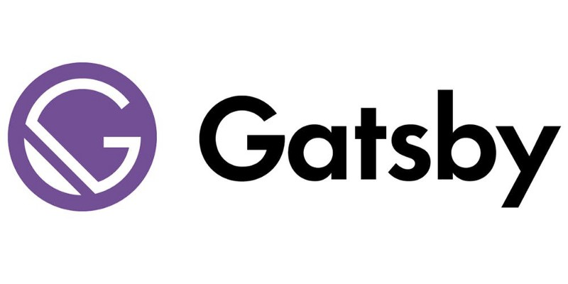
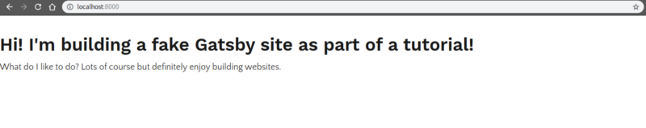
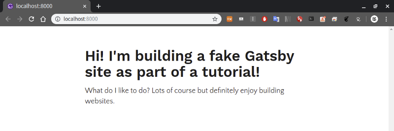
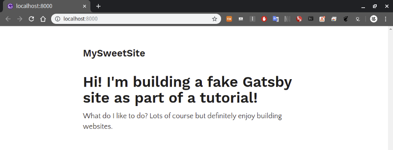
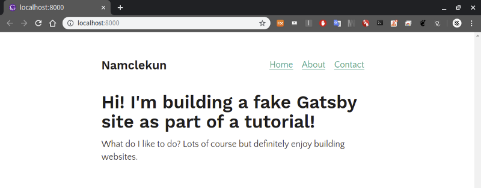

layout 구성 및 plugin 사용



[**Gatsby.js로 블로그 만들기\[4\]**  
_스타일링_medium.com](https://medium.com/@siisee111/gatsby-js%EB%A1%9C-%EB%B8%94%EB%A1%9C%EA%B7%B8-%EB%A7%8C%EB%93%A4%EA%B8%B0-4-cebfac8a5cb4 "https://medium.com/@siisee111/gatsby-js%EB%A1%9C-%EB%B8%94%EB%A1%9C%EA%B7%B8-%EB%A7%8C%EB%93%A4%EA%B8%B0-4-cebfac8a5cb4")[](https://medium.com/@siisee111/gatsby-js%EB%A1%9C-%EB%B8%94%EB%A1%9C%EA%B7%B8-%EB%A7%8C%EB%93%A4%EA%B8%B0-4-cebfac8a5cb4)

포스트 별로 큰 관련은 없는데, 위의 포스트에서 이어집니다.

이제 설명할 plugin과 layout 사용을 따라하다보면 ‘내가 웹을 만들고 있구나’ 라고 느껴지는 단계이다.

그래서 쫌 재밌다.

---

### Plugin 사용

어떤 툴을 이용하던 plugin을 사용해서 더 편하게 작업한 경험이 있을 것이다. Gatsby도 똑같이 plugin을 제공한다.

[https://www.gatsbyjs.org/plugins/](https://www.gatsbyjs.org/plugins/)

그 중에서 typography라는 플러그인을 사용한다.

타이포그라피라는 플러그인은 전체적인 테마(폰트, 크기 등)를 잡아주는 플러그인이다. 위의 페이지에 접속해서 살펴보면 용도를 알 수 있다.

우선 npm으로 다운받는다. 테마들 중에 fairy-gates 테마를 받는 것이다.

```
npm install --save gatsby-plugin-typography react-typography typography typography-theme-fairy-gates
```

gatsby-config.js 에 다음을 추가한다. 이 파일도 gatsby-browser.js와 같이 gatsby가 인식하는 파일 중 하나이다. 자세한 것은 아래 링크에서 확인.

```
module.exports = {
  plugins: [
    {
      resolve: `gatsby-plugin-typography`,
      options: {
        pathToConfigModule: `src/utils/typography`,
      },
    },
  ],
}
```

[**Gatsby Config API**  
_Site configuration options for a Gatsby site are placed in a file at the root of the project folder called…_www.gatsbyjs.org](https://www.gatsbyjs.org/docs/gatsby-config/ "https://www.gatsbyjs.org/docs/gatsby-config/")[](https://www.gatsbyjs.org/docs/gatsby-config/)

기존에 있던 index.js를 지우고 새롭게 작성한다.

```
> gatsby develop
```

테마가 적용되어 각각 테그마다 다른 글씨체나 사이즈가 표현된 것을 볼 수 있다.



아직 블로그 같지는 않다.

요즘 블로그들은 양 옆에 여백을 두고 가운데 정렬을 해놓은 스타일을 자주 사용한다. 한번 모방해보자.

div 태그에 스타일 속성을 추가해준다.

```
import React from "react"

export default () => (
  <div style={{ margin: `3rem auto`, maxWidth: 600 }}>
    <h1>Hi! I'm building a fake Gatsby site as part of a tutorial!</h1>
    <p>
      What do I like to do? Lots of course but definitely enjoy building
      websites.
    </p>
  </div>
)
```

페이지가 하나만 있는 것은 블로그라고 하기 좀 그렇다. pages 폴더 밑에 about 페이지와 contact 페이지를 추가로 만든다.

about.jscontact.js

---

### Layout component

드디어 첫 번째 레이아웃을 만들어 볼 것이다. 사실 기존의 스타터에서 사용하고 있긴 한데, 그 것을 버리고 새로 만들어 볼 것이다.

src 밑에 component라는 디렉토리를 하나 생성한다. (이미 있을 것이다.)

src/component 밑에 layout.js를 생성한다. (이미 있는 것은 삭제해도 좋다.)

layout.js의 내용은 아까 index.js에 추가한 내용과 유사하다.

```
import React from "react"

export default ({ children }) => (
  <div style={{ margin: `3rem auto`, maxWidth: 650, padding: `0 1rem` }}>
    {children}
  </div>
)
```

src/pages/index.js 에 import와 <Layout>을 추가한다.

```
import React from "react"
import Layout from "../components/layout"

export default () => (
  <Layout>
    <h1>Hi! I'm building a fake Gatsby site as part of a tutorial!</h1>
    <p>
      What do I like to do? Lots of course but definitely enjoy building
      websites.
    </p>
  </Layout>
)
```

<Layout> 태그 사이의 내용이 { children }이 되어서 <div>태그 안에서 랜더링 된다.

다시 한번, component의 이점인 재사용 가능성을 활용해서 about.js와 contact.js에도 Layout을 적용할 수 있다.

layout.js만 살짝 바꿔줌으로써 모든 페이지에 쉽게 영향을 줄 수 있다. 예를 들어, <h3>태그로 제목을 layout.js에 추가해주면

```
import React from "react"

export default ({ children }) => (
  <div style={{ margin: `3rem auto`, maxWidth: 650, padding: `0 1rem` }}>
    <h3>MySweetSite</h3>
    {children}
  </div>
)
```

---

### Navigation Link

마지막으로 페이지간 넘어 다닐 수 있도록 navigation link가 필요하다. 보통 블로그의 오른쪽 위에 위치한 그 것이다.

Navigation!

위의 코드는 ListLink라는 컴포넌트를 새로 정의해서 사용하고 있다. ListLink에서는 props를 사용하고 있는데 이는 React.js를 배우면 더 자세히 알 수 있다.

간략하게 말하면 <ListLink> 태그의 속성 ‘to’가 props.to로 전달된다고 보면된다.



---

#### 다음포스트

[**Gatsby.js로 블로그 만들기\[6\]**  
_data in gatsby_medium.com](https://medium.com/@siisee111/gatsby-js%EB%A1%9C-%EB%B8%94%EB%A1%9C%EA%B7%B8-%EB%A7%8C%EB%93%A4%EA%B8%B0-6-11334abf5880 "https://medium.com/@siisee111/gatsby-js%EB%A1%9C-%EB%B8%94%EB%A1%9C%EA%B7%B8-%EB%A7%8C%EB%93%A4%EA%B8%B0-6-11334abf5880")[](https://medium.com/@siisee111/gatsby-js%EB%A1%9C-%EB%B8%94%EB%A1%9C%EA%B7%B8-%EB%A7%8C%EB%93%A4%EA%B8%B0-6-11334abf5880)
