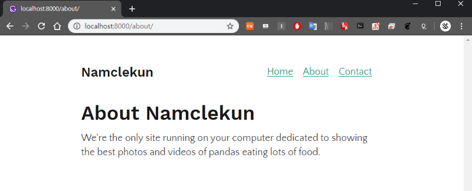
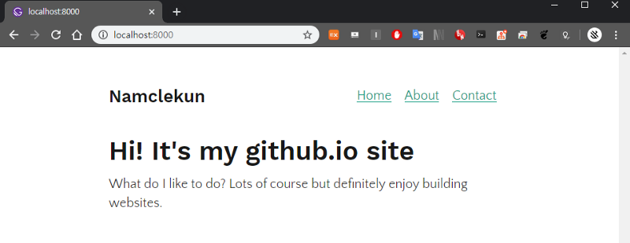

data in gatsby

[**Gatsby.js로 블로그 만들기\[5\]**  
_layout 구성 및 plugin 사용_medium.com](https://medium.com/@siisee111/gatsby-js%EB%A1%9C-%EB%B8%94%EB%A1%9C%EA%B7%B8-%EB%A7%8C%EB%93%A4%EA%B8%B0-5-d4736fd47533 "https://medium.com/@siisee111/gatsby-js%EB%A1%9C-%EB%B8%94%EB%A1%9C%EA%B7%B8-%EB%A7%8C%EB%93%A4%EA%B8%B0-5-d4736fd47533")[](https://medium.com/@siisee111/gatsby-js%EB%A1%9C-%EB%B8%94%EB%A1%9C%EA%B7%B8-%EB%A7%8C%EB%93%A4%EA%B8%B0-5-d4736fd47533)

위 포스트에서 이어집니다.

### Data in Gatsby.js

gatsby.js의 데이터 레이어에 대하여 살펴볼 것이다.

갯츠비의 데이터 레이어는 graphQL을 활용할 수 있다. GraphQL에 대한 설명은 아래 링크를 참고하면 된다.

[**How to GraphQL - The Fullstack Tutorial for GraphQL**  
_The free and open-source tutorial to learn all around GraphQL to go from zero to production. 42 MIN TOTAL In the first…_www.howtographql.com](https://www.howtographql.com/ "https://www.howtographql.com/")[](https://www.howtographql.com/)

앞의 단계들에서는 컴포넌트들을 만들어 화면을 구성하는 기초적인 방법들에 대하여 알아보았고, 이제 GraphQL을 이용해서 데이터를 컴포넌트에게 넣어주는 방법을 알아볼 것이다.

이전 포스트에서 만들어놓은 사이트를 사용한다.

-   gatsby-config.js

gatsby-config.js를 열어보면 맨 위에siteMetadata가 정의 되어있다.

```
siteMetadata: {
    title: `Gatsby Default Starter`,
    description: `Kick off your next, great Gatsby project with this default starter. This barebones starter ships with the main Gatsby configuration files you might need.`,
    author: `@gatsbyjs`,
}
```

title을 자신이 원하는 title로 바꾸고 이를 불러와서 component에 띄우는 것을 할 것이다.

src/pages/about.js 를 다음과 같이 고친다.

about.js

import 구문과 아래 query 구문이 추가 되었다.

about/ 을 확인해보면 반영이 된것을 볼 수 있다.



-   layout.js

레이아웃의 타이틀도 GraphQL을 사용하도록 바꿔주도록 하겠다.

about.js와는 다른 방식으로 GraphQL을 활용한다.

index.js

---

#### 다음포스트

[**Gastby.js로 블로그 만들기\[7\]**  
_GraphiQL 활용_medium.com](https://medium.com/@siisee111/gastby-js%EB%A1%9C-%EB%B8%94%EB%A1%9C%EA%B7%B8-%EB%A7%8C%EB%93%A4%EA%B8%B0-7-d18a85674f7d "https://medium.com/@siisee111/gastby-js%EB%A1%9C-%EB%B8%94%EB%A1%9C%EA%B7%B8-%EB%A7%8C%EB%93%A4%EA%B8%B0-7-d18a85674f7d")[](https://medium.com/@siisee111/gastby-js%EB%A1%9C-%EB%B8%94%EB%A1%9C%EA%B7%B8-%EB%A7%8C%EB%93%A4%EA%B8%B0-7-d18a85674f7d)
