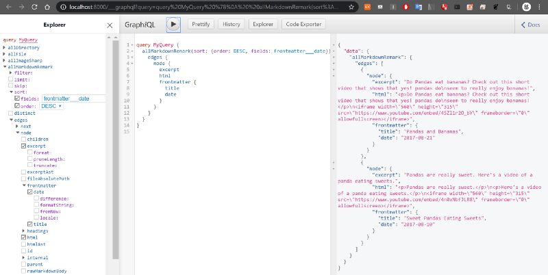
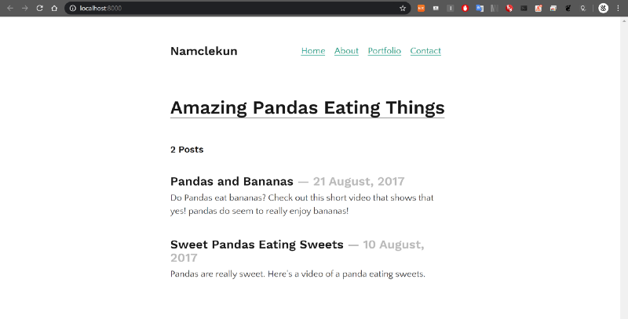

markdown으로 포스트 생성


[**Gastby.js로 블로그 만들기\[7\]**  
_GraphiQL 활용_medium.com](https://medium.com/@siisee111/gastby-js%EB%A1%9C-%EB%B8%94%EB%A1%9C%EA%B7%B8-%EB%A7%8C%EB%93%A4%EA%B8%B0-7-d18a85674f7d "https://medium.com/@siisee111/gastby-js%EB%A1%9C-%EB%B8%94%EB%A1%9C%EA%B7%B8-%EB%A7%8C%EB%93%A4%EA%B8%B0-7-d18a85674f7d")[](https://medium.com/@siisee111/gastby-js%EB%A1%9C-%EB%B8%94%EB%A1%9C%EA%B7%B8-%EB%A7%8C%EB%93%A4%EA%B8%B0-7-d18a85674f7d)

이전 포스트들을 완료했어야 이번 포스트를 수행할 수 있다.

블로그 사이트들을 보면 마크다운 언어로 작성하는 경우가 많다. 깃허브도 마크다운을 사용하고, jekyll도 마크다운을 사용하고, 이 미디엄도 유사 마크다운을 사용해서 블로그를 작성한다.

저번 포스트에서는 source plugin으로 data를 가져오는 것을 했으니, 이제 그 정보 (raw content)를 변형(transform)하는 것을 해볼 것이다.

### Transform plugin

가끔 source plugin으로 얻어온 데이터가 우리가 원하는 것이 아닐 수 있다. source plugin은 파일에 _대한_ 데이터를 얻어 오지만 우리가 포스트를 위해 필요한 정보는 파일 _안의_ 데이터들이다.

이를 위해서 Gatsby는 Transform plugin을 지원한다. 마크다운 파일을 예시로 사용해보자.

먼저, src/pages/에 sweet-pandas-eating-sweets.md파일을 만들어서 아래 내용을 작성한다. 이는 우리의 첫번째 포스트가 될 것이다. Jekyll을 해봤다면 익숙하겠지만, 위의 대쉬들 사이의 있는 것을 frontmatter라고 부른다.

```
---
title: "Sweet Pandas Eating Sweets"
date: "2017-08-10"
---

Pandas are really sweet.

Here's a video of a panda eating sweets.

<iframe width="560" height="315" src="https://www.youtube.com/embed/4n0xNbfJLR8" frameborder="0" allowfullscreen></iframe>
```

마크다운 파일을 작성했으니 transformer를 깔아준다.

```
> npm install --save gatsby-transformer-remark
```

또, 해당 plugin을 gatsby-config.js에 명시해준다.

```
plugins: [
    `gatsby-transformer-remark`,
    `gatsby-plugin-react-helmet`,
    {
        resolve: `gatsby-source-filesystem`,
        options: {
            name: `images`,
            path: `${__dirname}/src/`,
        },
    },
<이하 생략>
```

개발 서버를 다시 시작한다. 그럼 아래와 같이 allMarkdownRemark라는 항목이 새로 생긴 것을 볼 수 있다. allFile과 마찬가지로 동작하지만 markdown file에 대하여 동작한다.

allMarkdownRemark>edges>node의 html, excerpt와 frontmatter의 date와 title을 선택해서 실행시키면 아래와 같은 화면을 얻을 수 있다.


이제 대충 느낌이 온다. source 플러그인은 file들의 데이터를 가져오고, transform 플러그인은 이를 우리가 활용할 수 있게 데이터를 가공해서 제공한다.

가져온 데이터를 바탕으로 포스트들의 리스트를 보여주도록 index.js파일을 바꿔보자. 아래와 같이 index.js파일을 작성하고 포스트도 하나 더 만들어준다.

index.js

src/pages/pandas-and-bananas.md 는 다음과 같이 작성한다.

```
---
title: "Pandas and Bananas"
date: "2017-08-21"
---

Do Pandas eat bananas? Check out this short video that shows that yes! pandas do
seem to really enjoy bananas!

<iframe width="560" height="315" src="https://www.youtube.com/embed/4SZl1r2O_bY" frameborder="0" allowfullscreen></iframe>
```

### Sort post

마지막으로 프스트가 정렬이 안되어있는 문제를 해결해고자 한다. GraphiQL에서 allMarkdownRemark에서 sort에 fields는 frontmatter\_\_date(frontmatter의 date항목)로 설정하고, order는 DESC (내림차순)로 설정한다. 해당 쿼리를 복사해서 index.js에 붙혀넣어주면 완성이다.



2개의 포스트가 가까운 날짜 순으로 정렬되어서 보인다.



---

#### 다음포스트
