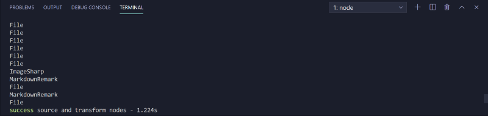
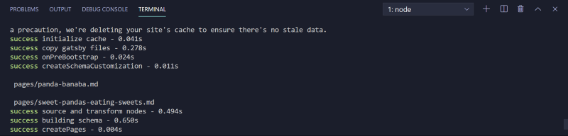
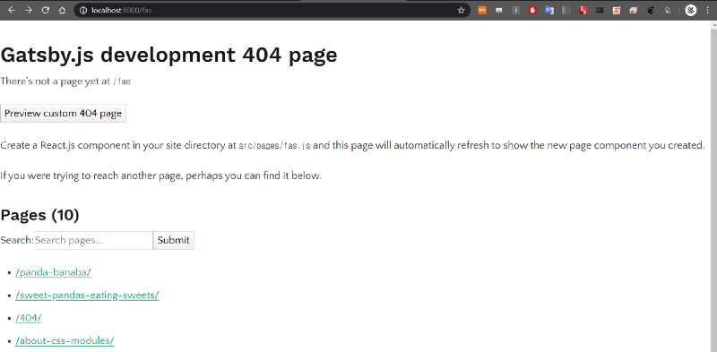
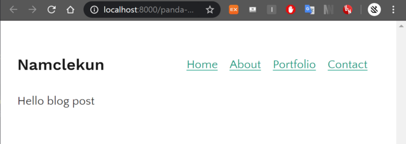
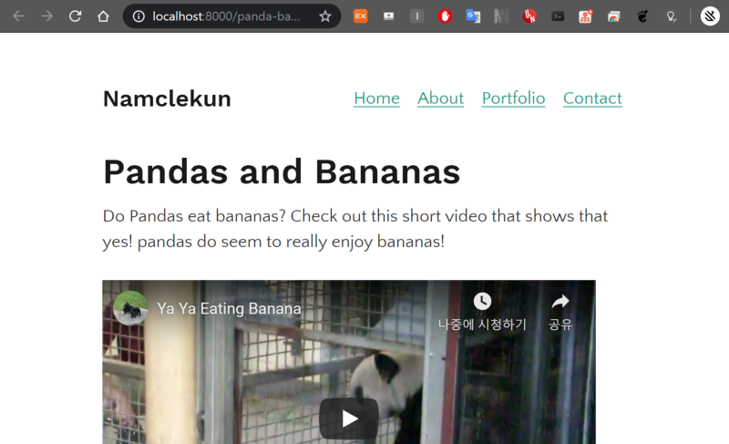

프로그래머답게 페이지 생성하는 법

마크다운 파일로 글을 작성하면 자동으로 페이지가 만들어지게 해야지 프로그래머답다.

### Creating slug for pages

페이지를 만드는 것은 두 단계로 이루어진다.

1.  페이지를 위한 slug 혹은 path를 생성하기
2.  페이지를 만들기

이를 위해서 필요한 핵심 API는 두가지로 `[onCreateNode](https://www.gatsbyjs.org/docs/node-apis/#onCreateNode)`와`[createPages](https://www.gatsbyjs.org/docs/node-apis/#createPages)` 이다.

### onCreateNode

일단 onCreateNode API를 사용해보자.

`gatsby-config.js` 를 열어서 다음의 내용을 추가한다.

```
exports.onCreateNode = ({ node }) => {
  console.log(node.internal.type)
}
```

development server를 다시 키면 아래와 같은 결과를 볼 수 있다. 모든 노드에 대하여 log가 찍힌 것을 볼 수 있다.



우리가 관심있는 것은 markdown 파일들이다. MarkdownRemark 노드들만 로깅되도록 아래와 같이 바꾼다.

```
exports.onCreateNode = ({ node }) => {
  if (node.internal.type === `MarkdownRemark`) {
    console.log(node.internal.type)
  }
}
```

마크다운 파일 두개만 로그에 찍힌것을 아래와 같이 확인할 수 있다.



이제 로그는 찍어봤으니 slug를 만들어 보자. slug란 파일의 경로 같은 것이다. createFilePath를 이용해서 생성한다.

```
const { createFilePath } = require(`gatsby-source-filesystem`)

exports.onCreateNode = ({ node, getNode }) => {
  if (node.internal.type === `MarkdownRemark`) {
    console.log(createFilePath({ node, getNode, basePath: `pages` }))
  }
}
```

생성한 slug를 Node의 fields에 넣어준다. 아래와 같이 코드를 바꿔준다.

```
const { createFilePath } = require(`gatsby-source-filesystem`)
exports.onCreateNode = ({ node, getNode, actions }) => {
  const { createNodeField } = actions
  if (node.internal.type === `MarkdownRemark`) {
    const slug = createFilePath({ node, getNode, basePath: `pages` })
    createNodeField({
      node,
      name: `slug`,
      value: slug,
    })
  }
}
```

그 후에 GraphQL에서 아래와 같이 node->fields->slug에서 확인 할 수 있다.


### Create pages with template code

Blog 포스트들의 내용을 담을 템플릿 (즉, 레이아웃)을 작성한다.

`src/templates/` 밑에 blog-post.js 파일을 만들고 아래와 같이 작성한다. 기본적인 틀을 만들어 두고 나중에 특정 포스트에 해당하는 내용들로 채워질 것이다.

```
import React from "react"
import Layout from "../components/layout"

export default () => {
  return (
    <Layout>
      <div>Hello blog post</div>
    </Layout>
  )
}
```

그 후에 `gatsby-config.js` 를 다음과 같이 수정한다.

이제 아무경로로 접속해보면 아래 페이지를 볼 수 있다. [http://localhost:8000/sdf](http://localhost:8000/sdf)



포스트 제목을 클릭해서 이동해보면 아래와 같이 기본적은 blog-post.js의 내용이 뜬다.



이로서 알 수 있는 것은 md파일의 제목에 해당하는 경로가 자동으로 생성되었다는 것이다.

이제 data query를 통해서 내용을 채워보자. blog-post.js 와 index.js를 수정해주어야 한다.

blog-post.jsindex.js

포스트에 대한 링크도 생성되었고 포스트의 내용물도 확인할 수 있다.

---

이로서 공식 홈페이지에 소개된 간단한 블로그 만드는 방법이었다. 영문 내용은 아래에서 확인 가능하다.

[**Gatsby.js Tutorials**  
_Welcome to Gatsby! We're glad you're here. The goal of this tutorial is to guide you through setting up and deploying…_www.gatsbyjs.org](https://www.gatsbyjs.org/tutorial/ "https://www.gatsbyjs.org/tutorial/")[](https://www.gatsbyjs.org/tutorial/)
