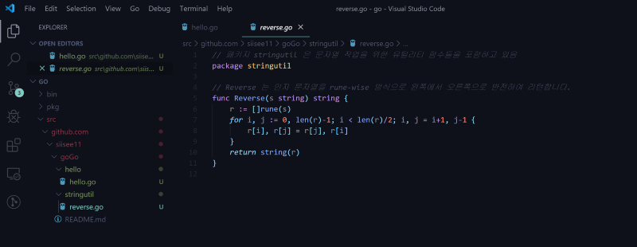
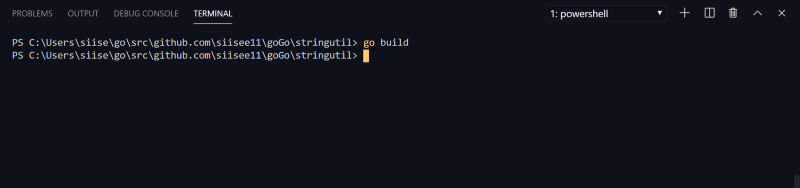
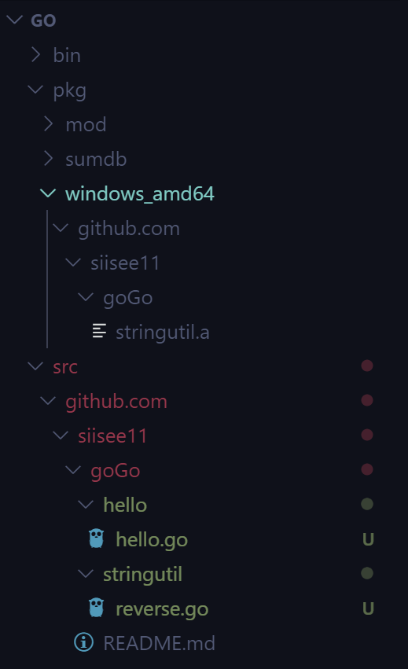
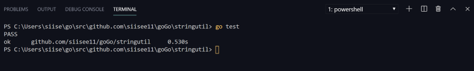

go lang으로 라이브러리 만들기


이전 포스트 : Window10에서 Go lang을 설치 및 설정하는 방법

[**Start Go lang with VSCode and github (Window 10)**  
_VScode와 깃허브로 Go languague 시작하기_medium.com](https://medium.com/@siisee111/start-go-lang-with-vscode-and-github-window-10-eff4b595e60a "https://medium.com/@siisee111/start-go-lang-with-vscode-and-github-window-10-eff4b595e60a")[](https://medium.com/@siisee111/start-go-lang-with-vscode-and-github-window-10-eff4b595e60a)

이 포스트의 내용은 아래 포스트의 내용을 참고하였습니다.

[**How to Write Go Code**  
_This document demonstrates the development of a simple Go package and introduces the go tool, the standard way to…_golang.org](https://golang.org/doc/code.html "https://golang.org/doc/code.html")[](https://golang.org/doc/code.html)

-   첫 라이브러리 생성

라이브러리를 만들어서 hello world 프로그램에 적용해본다.

먼저, 패키지를 생성할 경로를 선택해야한다.

이전 포스트에서 ‘go/src/github.com/<username>/goGo’ 경로를 사용했으므로 이 경로를 그대로 사용한다. goGo 하위에 stringutil 폴더를 만들고 reverse.go 파일을 생성한다.

```
$ cd go/src/github.com/<username>/goGo
$ mkdir stringutil
```

그 후에 reverse.go 파일에 다음 내용을 적는다.

```
// 패키지 stringutil 은 문자열 작업을 위한 유틸리티 함수들을 포함하고 있음
package stringutil

// Reverse 는 인자 문자열을 rune-wise 방식으로 왼쪽에서 오른쪽으로 반전하여 리턴합니다.
func Reverse(s string) string {
    r := []rune(s)
    for i, j := 0, len(r)-1; i < len(r)/2; i, j = i+1, j-1 {
        r[i], r[j] = r[j], r[i]
    }
    return string(r)
}
```

-   go build

해당 파일을 build해준다. go build는 실행파일을 생성하지 않는다. 그 대신 stringutil이라는 패키지를 컴파일해 저장한다.



파일 계층을 보면 pkg 폴더안에 .a파일 (라이브러리 파일)이 생성된 것이 보인다.



이제, 만들 라이브러리를 사용해보자.

다시 hello.go 파일을 열어서 다음과 같이 수정한다.

```
package main

import (
	"fmt"

	"github.com/user/goGo/stringutil"
)

func main() {
	fmt.Println(stringutil.Reverse("!oG ,olleH"))
}
```

go run hello.go 혹은 install로 실행하면 아래와 같다.

```
$ go run ./hello.go
Hello, Go!

$ go install
$ hello
Hello, Go!
```

여기까지 진행하였다면, 디렉토리 구조는 다음과 같다.

```
bin/
    hello                 # command executable
src/
    github.com/siisee11/goGo
        hello/
            hello.go      # command source
        stringutil/
            reverse.go    # package source
```

---

-   다음은 Testing에 관한 내용이다.

Go 언어에는 코드를 테스트해 볼 수 있는 방법이 있다. 파일 이름 뒤에 ‘\_test.go’를 붙힌 파일을 만들고 TestXXXX 라는 이름의 함수를 만들어서 테스트를 진행한다.  
stringutil package를 테스트하기 위해서 stringutil 폴더에 reverse\_test.go 파일을 만들어서 아래 내용을 추가한다.

```
package stringutil

import "testing"

func TestReverse(t *testing.T) {
	cases := []struct {
		in, want string
	}{
		{"Hello, world", "dlrow ,olleH"},
		{"Hello, 世界", "界世 ,olleH"},
		{"", ""},
	}
	for _, c := range cases {
		got := Reverse(c.in)
		if got != c.want {
			t.Errorf("Reverse(%q) == %q, want %q", c.in, got, c.want)
		}
	}
}
```

terminal을 열어 go test를 입력한다.



---

-   remote package (Go & github)

go는 github와 같이 사용하면 좋다. 다음은 github에서 remote package를 가져오는 방법이다. 아래 github에서 package를 가져올 것이다.

[**golang/example**  
_This repository contains a collection of Go programs and libraries that demonstrate the language, standard libraries…_github.com](https://github.com/golang/example "https://github.com/golang/example")[](https://github.com/golang/example)

사용할 커맨드는 go get이다.

git clone과 go build, go install 을 합쳐놓은 것 같은 명령어이다. 깃에서 소스를 가져와서 build와 install까지 자동으로 해준다.

```
$ go get github.com/golang/example/hello
```

아래는 결과 화면이다.


