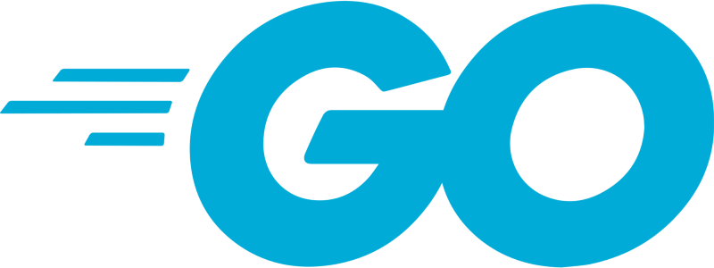

Programmers 1단계 문제 K번째수 Go 언어 풀이

Go 언어를 사용하여 programmers 1단계 문제인 K번째수를 푸는 방법과 코드가 맞는지 확인하기위한 테스트코드 작성에 대한 포스트이다.

[**코딩테스트 연습 - K번째수 | 프로그래머스**  
_배열 array의 i번째 숫자부터 j번째 숫자까지 자르고 정렬했을 때, k번째에 있는 수를 구하려 합니다. 예를 들어 array가 \[1, 5, 2, 6, 3, 7, 4\], i = 2, j = 5, k = 3이라면…_programmers.co.kr](https://programmers.co.kr/learn/courses/30/lessons/42748 "https://programmers.co.kr/learn/courses/30/lessons/42748")

1단계여서 금방하겠지라고 생각했는데, 생각보다 언어에 적응하는데 오래걸렸다.

문제에서 array가 주어지고 i번째에서 j번째까지의 sub array를 구한 후 정렬하고 k번째 수를 반환하는 간단한 문제이다.

Go에서도 python에서와 같이 인덱싱을 통해 sub array를 구할 수 있으므로

[**A Tour of Go**  
_Go 프로그래밍 언어 투어에 오신 것을 환영합니다. 이 투어는 3개의 섹션으로 되어 있고, 각 섹션의 마지막 부분에는 좀더 완벽한 이해를 돕기 위해 연습문제가 준비되어 있습니다. 지금 Run 버튼을 클릭해보거나…_go-tour-kr.appspot.com](https://go-tour-kr.appspot.com/#31 "https://go-tour-kr.appspot.com/#31")

위 특성을 이용하기로 했다.

정렬은 import(“sort”)한 후 비교 메소드를 만들어주면 된다.

---

아래는 내가 작성한 정답 코드이다.

Solution.go

여기서 주의해야 할 것이 아래와 같이 new\_slice를 선언하면 new\_slice가 바뀌면 기존의 array도 바뀌게 된다. 따라서 위의 정답 코드 같이 copy 혹은 빈 slice에 append하는 등의 방식으로 복사해서 사용해야 한다.

Wrong\_solution.go

---

Programmers 문제들은 main 을 짜지 않기 때문에, VScode를 사용해서 테스트하기불편한 점이 있다.

하지만 Go 언어는 자체 test 프레임워크가 존재하기 때문에 test파일을 만들어서 자신의 코드를 실험해 볼 수 있다.

위의 해답 코드와 같은 패키지를 적어 주어야 하고 test할 코드 에서 Test<함수이름> (여기에서는 TestSolution) 함수를 구현해주면 된다.

아래의 코드를 solution\_test.go (위의 코드가 solution.go이므로)라는 이름으로 solution.go와 같은 폴더에 넣어준다.

위 코드에서 눈여겨봐야 할 것은 두 슬라이드를 비교하는 것은 단순히 ‘==’이나 ‘!=’로 비교할 수 없고, “reflect”를 import하여 reflect.DeepEqual을 사용해야 한다는 것이다.

이 코드를 응용하면 앞으로 만들 프로그래머스 코드를 자체적으로 test 해볼 수 있다.
