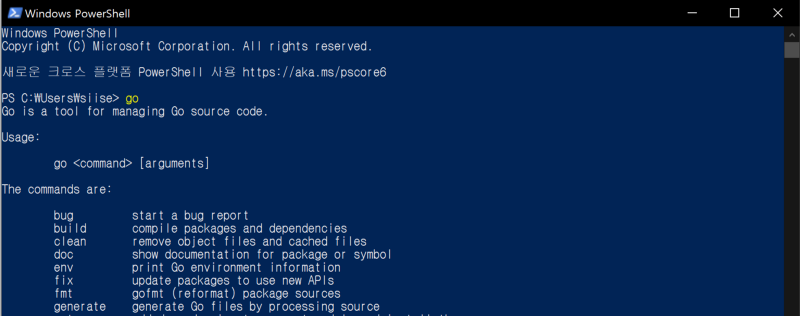
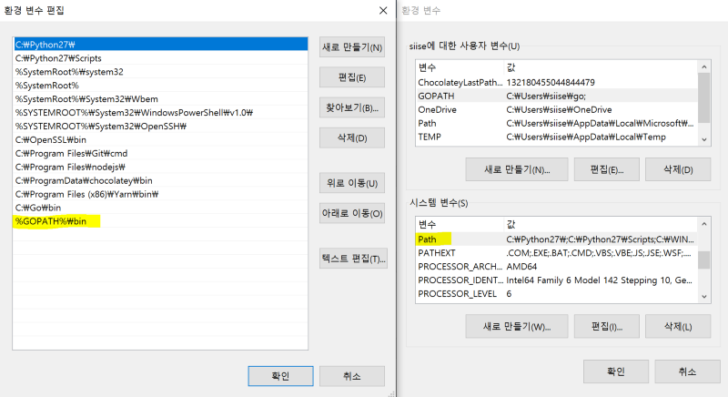
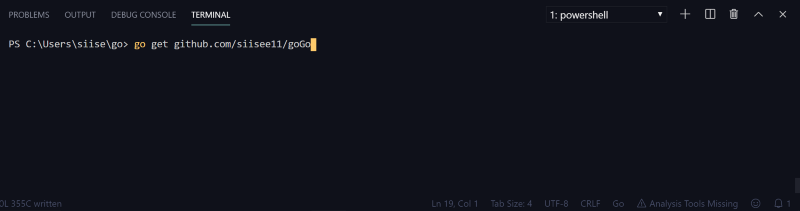

VScode와 깃허브로 Go languague 시작하기


VScode로 Go 프로그래밍을 하기 위한 설정 방법 및 github와 연동하는 방법을 소개한다.

-   VScode 설치는 아래 주소에서 다운로드 받아서 가능하다.

[https://code.visualstudio.com/](https://code.visualstudio.com/)

-   Go language download는 아래 주소에서 받을 수 있다.

[**Downloads**  
_Go is an open source programming language that makes it easy to build simple, reliable, and efficient software._golang.org](https://golang.org/dl/ "https://golang.org/dl/")[](https://golang.org/dl/)

-   다음은 Go path 설정이다.   
    윈도우의 경우 msi 실행파일로 설치했을 경우에 자동으로 C:\\Go\\bin이 path에 설정된다. window + X 후에 I 키를 눌러서 powershell을 킨 후 go 를 쳐서 실행되나 확인해본다. 아래와 같이 뜨면 된거다.



go 언어는 특이하게 하나의 workspace를 생성하고 그 곳에서 모든 go 프로그래밍을 진행하게된다.   
**_‘내 PC 오른쪽 클릭 -> 속성 -> 고급 시스템 설정 -> 환경변수 -> GOPATH’_**  
에 자신이 workspace로 사용하려는 위치를 적어준다. 기본적으로 %USERPROFILE%\\go 로 되어있을 것인데, 이를 그대로 사용하였다.


-   원래는 나중에 필요에 의해서 하게 되지만, 기왕 환경변수 설정한거 아래 Path까지 수정한다. 아래쪽 Path를 더블클릭후 새로만들기. %GOPATH%\\bin을 추가해준다.   
    나중에 내가 만든 실행파일을 간편하게 실행 시킬 수 있다.



-   VScode에서 ‘file -> openfolder’로 위에서 GOPATH로 설정한 폴더를 열어준다.
-   VScode에 go extension을 깔아준다. 단축키(ctrl + shift + x)로 extension market place를 열어서 go 라고 치면 맨위에 뜬다. install 버튼 누르면 된다.


-   다음은 깃허브와 연동해서 go로 hello world를 띄우는 내용이다. go언어가 github와 꽤 친한 사이라 github를 쓰지 않아도되지만 github를 쓰는 것이 좋다. github에 새로운 레파지토리를 생성한다. (이름은 goGo)

](./asset-6.png)

-   VScode에서 Terminal > new Terminal로 터미널을 켜준다.  
    go get 커맨드로 go를 사용하기 위한 환경을 자동으로 설정할 수 있다.  
    http:// 나 .git이 붙지않는 것을 유의!

```
$ go get github.com/siisee11/goGo   // 자기 github아이디로 바꾸기
```

-   생성된 폴더로 이동하면, 아마 README.md (github에서 만들었다면)이 있을 것이다.
-   hello world 코딩을 해보자.  
    goGo폴더 하위에 hello라는 폴더를 생성하고 hello.go 파일을 그 안에 생성한다. (폴더 명으로 실행파일이 생기니까 폴더명 hello로!)

```
package main

import "fmt"

func main() {
	fmt.Println("Hello, world.")
}
```

-   다시 터미널을 열어서, goGo/hello 폴더로 이동한다.  
    go run hello.go 로 바로 실행해 볼 수 있다.  
    go install 로 실행파일을 만들 수 있다. 실행파일은 Window의 경우 .exe 파일 이고 GOPATH\\bin에 생성된다.  
    go install 후에 hello를 입력해서 실행파일을 실행할 수 있다. (이는 위에 path에 %GOPATH%\\bin을 넣어줬기 때문이다)


---

혹시 expected ‘package’, found ‘EOF’ 에러가 난다면 ctrl + s 를 눌러주자.
