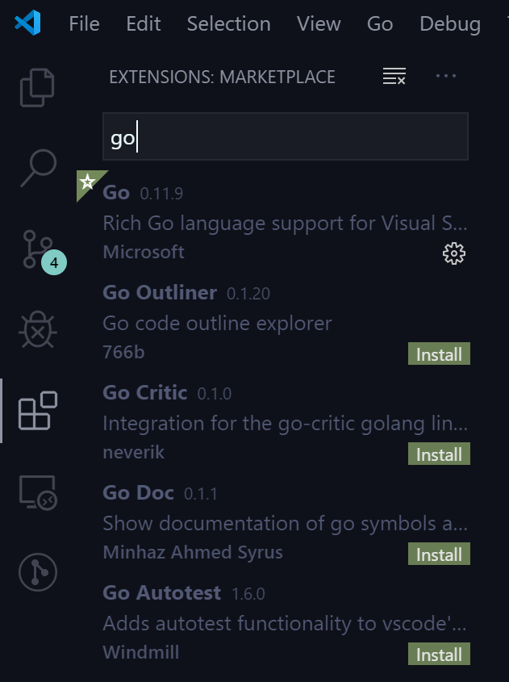
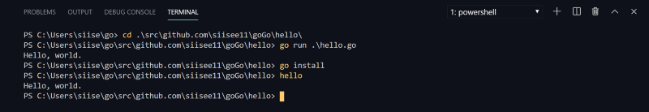

go on ubuntu


Download VScode for linux here

[**Documentation for Visual Studio Code**  
_Find out how to set-up and get the most from Visual Studio Code. Optimized for building and debugging modern web and…_code.visualstudio.com](https://code.visualstudio.com/docs/?dv=linux64_deb "https://code.visualstudio.com/docs/?dv=linux64_deb")[](https://code.visualstudio.com/docs/?dv=linux64_deb)

```
$ sudo su - 
$ curl -O https://storage.googleapis.com/golang/go1.13.5.linux-amd64.tar.gz
$ tar -C /usr/local -xzf go1.13.5.linux-amd64.tar.gz
$ vim /etc/profile

# add below line at the end of the file
export PATH=$PATH:/usr/local/go/bin
``````
$ vim .zshrc  # if you use zsh
$ vim .bash_profile # if you use bash

# add below line at the end of the file
export GOPATH=$HOME/go
export PATH=$PATH:$GOPATH/bin

$ source !$
```

To test the hello world code

```
$ cd go
$ mkdir -p src/hello && cd src/hello
$ go install
$ hello
```

---

-   Below this line is same as window10
-   VScode에서 ‘file → openfolder’로 위에서 GOPATH로 설정한 폴더를 열어준다.  
    \[‘File → openfolder → $GOPATH’ to open your go workspace in VScode\]
-   VScode에 go extension을 깔아준다. 단축키(ctrl + shift + x)로 extension market place를 열어서 go 라고 치면 맨위에 뜬다. install 버튼 누르면 된다.  
    \[Install go extension on VScode(shortcut: ctrl + shift + x). It would be shown on the top\]



-   다음은 깃허브와 연동해서 go로 hello world를 띄우는 내용이다. go언어가 github와 꽤 친한 사이라 github를 쓰지 않아도되지만 github를 쓰는 것이 좋다. github에 새로운 레파지토리를 생성한다. (이름은 goGo)  
    \[Let’s do hello world example with go and github. Create new repository on github, in my case I named goGo\]

](./asset-4.png)

-   VScode에서 Terminal > new Terminal로 터미널을 켜준다.  
    go get 커맨드로 go를 사용하기 위한 환경을 자동으로 설정할 수 있다.  
    http:// 나 .git이 붙지않는 것을 유의!  
    \[Open terminal on VScode and type below on go workspace directory.\]

```
$ go get github.com/siisee11/goGo   // Change 'siisee11' to yours
```

-   hello world 코딩을 해보자.  
    goGo폴더 하위에 hello라는 폴더를 생성하고 hello.go 파일을 그 안에 생성한다. (폴더 명으로 실행파일이 생기니까 폴더명 hello로!)  
    \[Let’s make hello world program. Create new directory (the name of this directory will be your executable name) and create hello.go file in that folder and copy-and-paste below code.\]

```
package main

import "fmt"

func main() {
	fmt.Println("Hello, world.")
}
```

-   다시 터미널을 열어서, goGo/hello 폴더로 이동한다.  
    go run hello.go 로 바로 실행해 볼 수 있다.  
    go install 로 실행파일을 만들 수 있다. 실행파일은 Window의 경우 .exe 파일 이고 GOPATH\\bin에 생성된다.  
    go install 후에 hello를 입력해서 실행파일을 실행할 수 있다. (이는 위에 path에 %GOPATH%\\bin을 넣어줬기 때문이다)  
    \[Reopen your terminal and go to ‘github.com/user/goGo/hello’. ‘go run hello.go’ to execute directly from code. ‘go install’ to make executable file. After ‘go install’, you can run hello program typing ‘hello’ on terminal.\]



---

혹시 expected ‘package’, found ‘EOF’ 에러가 난다면 ctrl + s 를 눌러주자.  
\[If there is _expected ‘package’, found ‘EOF’ error_, just press ctrl + s\]
