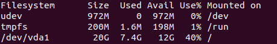
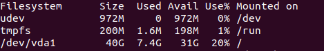

우분투 KVM 저장용량 늘리기

KVM 저장용량을 20G로 잡았다가 금방 다 차버려서 늘리기로 하였다.

-   qemu-img 툴을 이용해서 .qcow2 사이즈를 키워준다. qcow2 파일의 위치는 /usr/lib/libvirt/images가 아닐 수도 있다.

```
$ cd /usr/lib/libvirt/images
$ qemu-img resize ubuntu18.04-3.qcow2 +20G
```

-   디스크의 사이즈는 키웠으나, VM을 실행하여 du -h로 사이즈를 보면 아직 반영이 안되어있다.



-   fdisk 유틸리티를 이용해서 /dev/vda1의 사이즈를 늘려주어야 한다.

```
Command (m for help): p
Disk /dev/vda: 40 GiB, 42949672960 bytes, 83886080 sectors
Units: sectors of 1 * 512 = 512 bytes
Sector size (logical/physical): 512 bytes / 512 bytes
I/O size (minimum/optimal): 512 bytes / 512 bytes
Disklabel type: dos
Disk identifier: 0x06f0d3f8

Device     Boot Start      End  Sectors Size Id Type
/dev/vda1  *     2048 41940991 41938944  20G 83 Linux

Command (m for help): d
Selected partition 1
Partition 1 has been deleted.

Command (m for help): n
Partition type
   p   primary (0 primary, 0 extended, 4 free)
   e   extended (container for logical partitions)
Select (default p):

Using default response p.
Partition number (1-4, default 1): 
First sector (2048-83886079, default 2048): 
Last sector, +sectors or +size{K,M,G,T,P} (2048-83886079, default 83886079):

Created a new partition 1 of type 'Linux' and of size 40 GiB.
Partition #1 contains a ext4 signature.

Do you want to remove the signature? [Y]es/[N]o: n

Command (m for help): t

Selected partition 1
Hex code (type L to list all codes): 83
Changed type of partition 'Linux' to 'Linux'.

Command (m for help): a
Selected partition 1
The bootable flag on partition 1 is enabled now.

Command (m for help): w
The partition table has been altered.
Syncing disks.
```

위와 같이 진행한다.

-   마지막으로 file system이 전체공간을 인식하도록 해주면 끝이다.

```
$ resize2fs /dev/vda1
```
