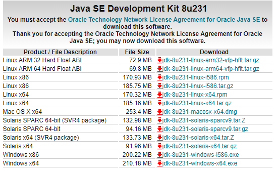
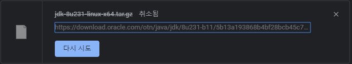

Spark를 설치하기에 앞서서 JAVA를 설치

Ubuntu18.04에서 실험을 돌려보기 위해 Spark를 설치하려고 하는데, 먼저 JAVA를 설치해야된다고 한다.

예전에는 JAVA를

```
$ add-apt-repository ppa:webupd8team/java
$ apt-get update
$ apt-get install oracle-java8-installer

E: Package 'oracle-java8-installer' has no installation candidate
```

이렇게 repository를 추가해서 쉽게 설치할 수 있었던 것 같은데, 이제 저렇게 하면 에러가 난다.

이제 직접 tar.gz파일을 다운로드 받아와서 설치해 주어야 한다.

[**Java SE Development Kit 8 Downloads**  
_Thank you for downloading this release of the Java™ Platform, Standard Edition Development Kit (JDK™). The JDK is a…_www.oracle.com](https://www.oracle.com/technetwork/java/javase/downloads/jdk8-downloads-2133151.html "https://www.oracle.com/technetwork/java/javase/downloads/jdk8-downloads-2133151.html")[](https://www.oracle.com/technetwork/java/javase/downloads/jdk8-downloads-2133151.html)

약관에 동의하고 linux64 용 tar.gz를 다운 받는다. (32 비트면 86)



CLI 밖에 없다면 다운로드 링크 복사해서 wget을 통해 다운로드 받으면 된다

```
wget  https://download.oracle.com/otn/java/jdk/8u231-b11/5b13a193868b4bf28bcb45c792fce896/jdk-8u231-linux-x64.tar.gz?AuthParam=************************
```

다운로드 받은 tar.gz의 압축을 풀고 /usr/local/java에 복사해준 뒤에 그 경로를 윈도우와 유사하게 환경변수에 추가해준다.

```
$ tar xvzf jdk-8u231-linux-x64.tar.gz
$ cd /usr/local/
$ mkdir java
$ cd java
$ mv <unzipped file> .

# 환경 설정
$ vim /etc/profile

# 파일 맨 아래에 밑의 라인 삽입
JAVA_HOME=/usr/local/java/jdk1.8.0_231
JRE_HOME=$JAVA_HOME/jre
PATH=$PATH:$JAVA_HOME/bin:$JRE_HOME/bin
export JAVA_HOME
export JRE_HOME
export PATH

# 재 로그인 후 확인
java -version
```

JAVA 설치를 완료 하였다.
