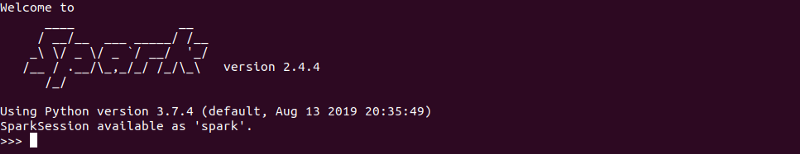

우분투에 스파크를 설치

SPARK를 설치해서 성능을 benchmark해보려고 한다.

먼저, 스파크 설치를 위해 JAVA를 설치해야한다.

[**Ubuntu18.04에 JAVA 설치하기**  
_Spark를 설치하기에 앞서서 JAVA를 설치_medium.com](https://medium.com/@siisee111/ubuntu18-04%EC%97%90-java-%EC%84%A4%EC%B9%98%ED%95%98%EA%B8%B0-f63a7dcd9d9a "https://medium.com/@siisee111/ubuntu18-04%EC%97%90-java-%EC%84%A4%EC%B9%98%ED%95%98%EA%B8%B0-f63a7dcd9d9a")[](https://medium.com/@siisee111/ubuntu18-04%EC%97%90-java-%EC%84%A4%EC%B9%98%ED%95%98%EA%B8%B0-f63a7dcd9d9a)

그리고 python 환경이 갖춰져 있지 않다면 python도 설치해주어야 하는데, 쉽게 환경 구축을 하기 위해 Anaconda도 설치해 주어야 한다.

마지막으로, 스파크를 설치하여 보자.

스파크는 아래의 웹사이트에서 다운로드 받을 수 있다.

[**Downloads | Apache Spark**  
_Note that, Spark is pre-built with Scala 2.11 except version 2.4.2, which is pre-built with Scala 2.12. Preview…_spark.apache.org](https://spark.apache.org/downloads.html "https://spark.apache.org/downloads.html")[](https://spark.apache.org/downloads.html)

다운로드 받았다면 압축을 풀어준다. 그 후 home 디렉토리 밑에 spark라는 폴더를 만들어 그 곳으로 옮겨주도록 한다.

```
$ tar xvzf <tgz file>
$ cd ~
$ mkdir spark & cd spark
$ mv <unzipped file> .

# Spark 실행
$ cd ~/spark/spark<Tab>/bin
$ ./pyspark
```

스파크 실행할 때 마다 해당 폴더로 들어가서 실행하기 귀찮으므로, 환경 변수 설정을 해줘야 한다.

해당 유저의 PATH에만 추가하면 되므로 ~/.bashrc에 추가해주도록 한다.

```
$ vim ~/.bashrc

# 맨 아래에 다음 줄 추가 (폴더명 확인!)
export SPARK_HOME=~/spark/spark-2.4.4-bin-hadoop2.7/
export PATH=$PATH:$SPARK_HOME/bin

# bashrc reload
$ source !$
```

Spark 설치가 완료되었다.
