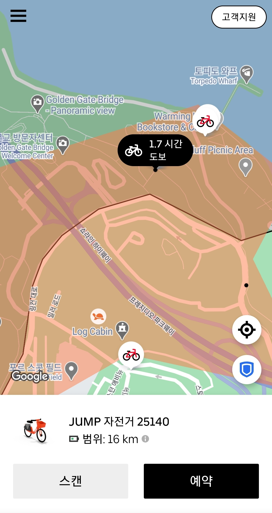

Sanfrancisco에서 Uber를 처음 이용해보면서 적는 Uber honey tip.

---

1. Uber는 취소 및 지각 수수료가 있다. 

Uber기사가 Pickup장소에서 기다리게 되는 경우 추가 요금이 발생하고, 5분 이상 경과하면 기사가 취소 가능하며 수수료 5달러가 부과된다.

> pickup장소와 차량 종류(짐을 실을 수 있는 차 종인지)를 먼저 잘 확인한 후에 부른다.

1. Uber기사가 출발하지 않은 상태에서 취소를 할 경우, 취소 수수료가 붙지 않는다. (불확실)

확실하진 않지만, *기사와 연락한 후에* 기사가 출발하지 않은 상태에서 취소했을 때는 수수료가 붙지 않았다.

1. Uber의 가장 싼 기종에는 케리어 3개가 실리지 않는다.

기사에게 톡으로 먼저 물어보자.

1. Uber 자전거는 구역 밖에서 주차할 시 추가 요금이 징수 된다.

아래 그림에서 검은색으로 표시된 부분이 구역이다. 이 밖에서 주차할 시에 250.00$가 부과된다.

1. Uber 자전거 외에도 lyft, Lime등 어플을 더 설치한다.

주변에 Uber저전거가 없을 수도 있다. lyft, Lime등 다른 회사의 이동 수단도 이용해보자.
