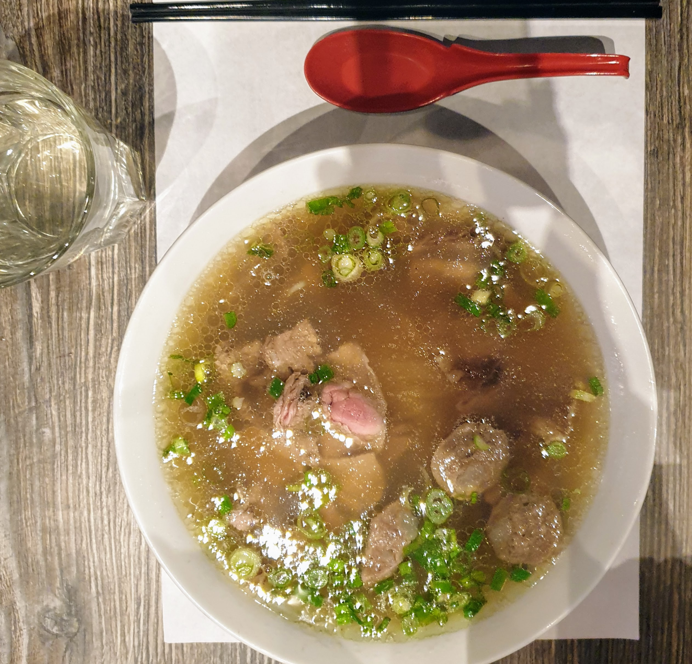
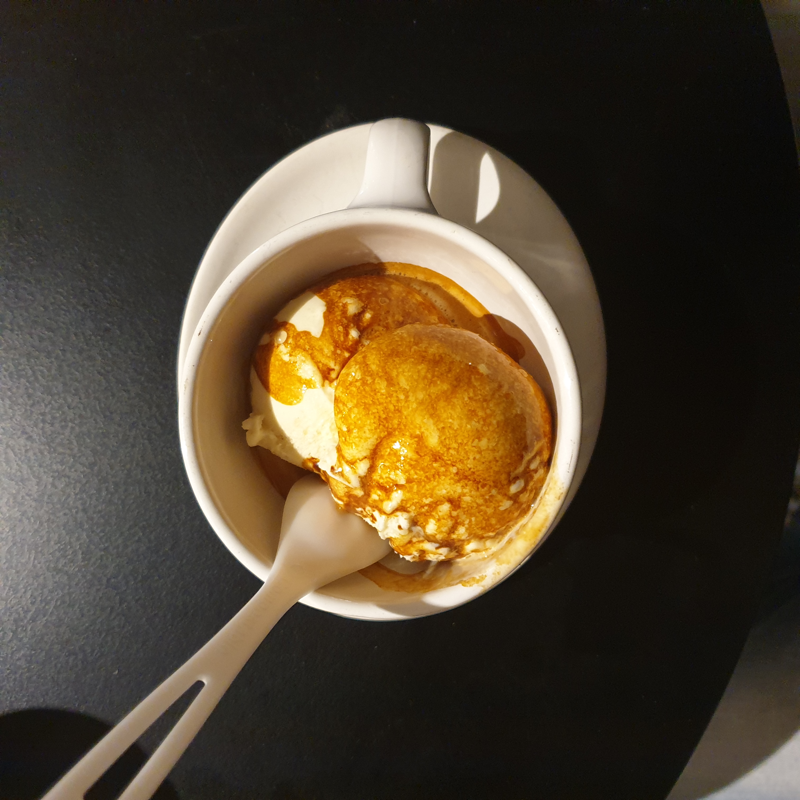
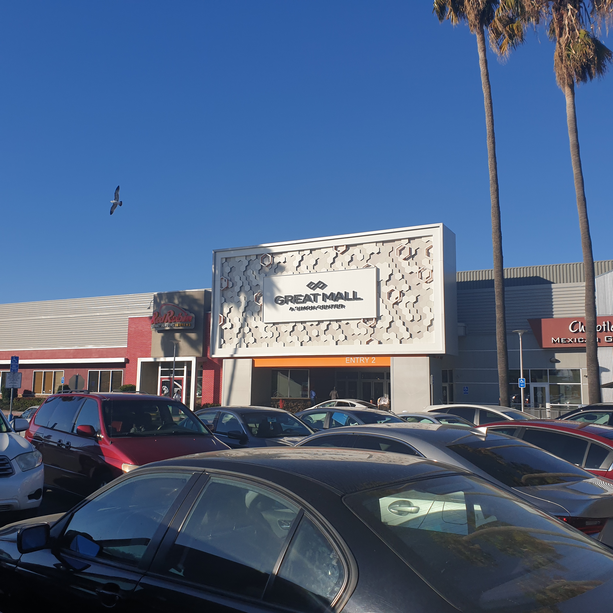
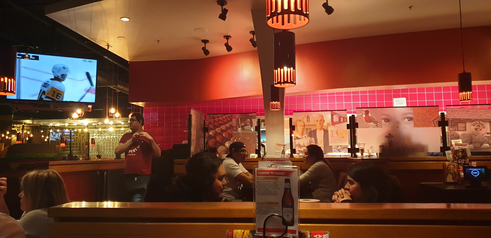
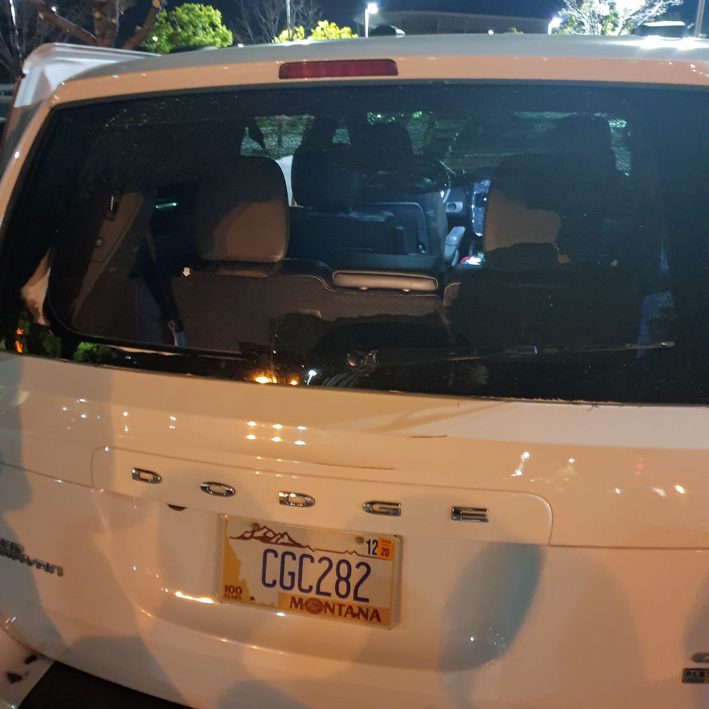
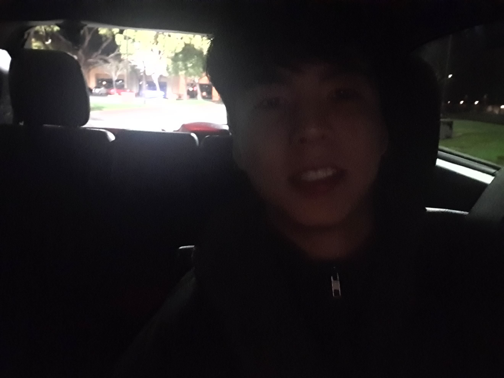

Sanfrancisco day 5.
*차악의 날*
> 2020-02-26

---

## 교수님 제자 만남
교수님 제자로 스타트업의 senior engineer이신 분과 점심 식사

Paloalto는 부자 동네인데, pho가 16달러이다.

---

## 또 블루보틀
교수님 제자분께서 후식을 사주셨다.
아포가토가 특이하다고 하니 아포카토를 주문

꾸덕하고 달았다.

---

## 오후 세션 끝나고 쇼핑
4년 전에도 갔었던 greatmall에서 쇼핑

이덕에 지갑을 들고 다니게 된 것이 신이 한수

---

## 봉 대신 버거
*Buffalo wild wings*를 먹으러 갔다가 문이 닫겨 있어서, *Red Robin*에서 식사를 했다.

추후 위 두 식당은 우리에게 영구밴을 당했다.

---

## 차량 털이
레전드 여행의 시작

노트북 탐지기가 있다고 한다. 트렁크 창문을 깨고 가방을 다 가졌갔다.

덕분에 현지 경찰도 봤는데, 까불면 죽겠더라

---

## 오픈카
경찰이 가고나서 밤 중에 뒷 창문 오픈 카를 타고 공항으로 출발

운전 면허증도 사라져서 이 때부터 교수님이 전부 운전하셨다 ㅜㅜ

---

## 전체 경로
![26][26.jpg]
